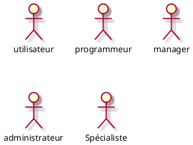
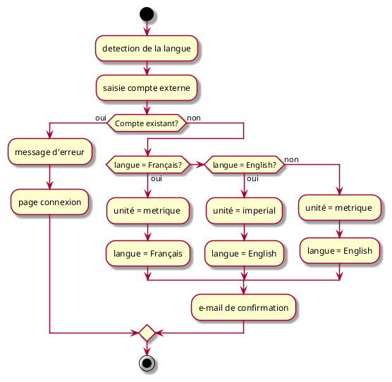
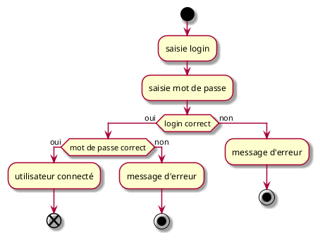
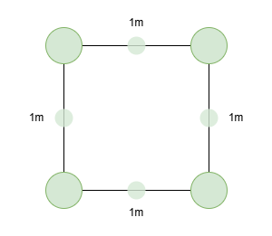
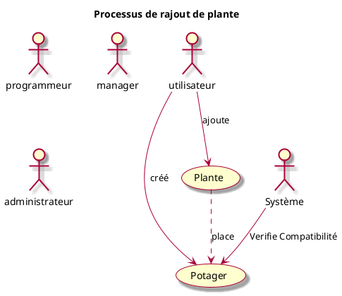
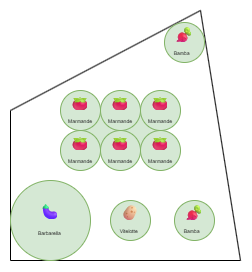
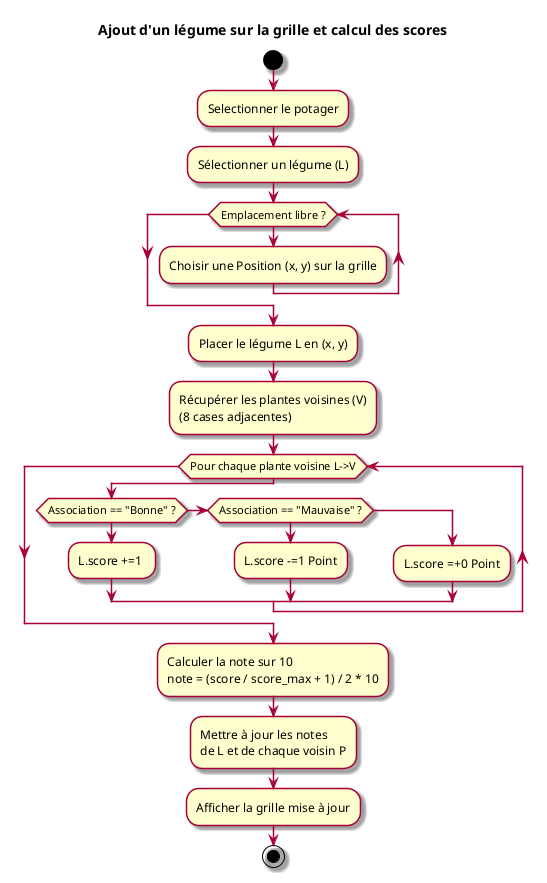
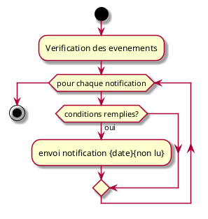
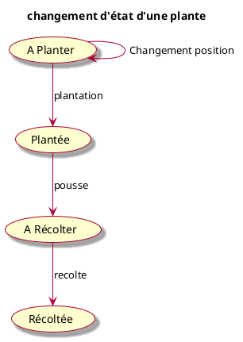
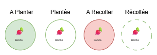

# Projet *PlanPotager* : Expression des besoins V 0.1

- [Projet *PlanPotager* : Expression des besoins V 0.1](#projet-planpotager--expression-des-besoins-v-01)
  - [1. Objectif du document](#1-objectif-du-document)
  - [2. Présentation](#2-présentation)
    - [2.1. Présentation du projet](#21-présentation-du-projet)
    - [2.2. Situation actuelle](#22-situation-actuelle)
    - [2.3. Les contraintes](#23-les-contraintes)
    - [2.4. Présentation de la société (fictive)](#24-présentation-de-la-société-fictive)
  - [3. Acteurs](#3-acteurs)
    - [3.1. Utilisateur](#31-utilisateur)
    - [3.2. Administrateur](#32-administrateur)
    - [3.3. Manager](#33-manager)
    - [3.4. Programmeur](#34-programmeur)
    - [3.5 Spécialiste](#35-spécialiste)
    - [3.6. Résumé des Acteurs](#36-résumé-des-acteurs)
  - [4. Cas d’utilisation](#4-cas-dutilisation)
      - [4.1. Cas d'utilisation « Créer un compte »](#41-cas-dutilisation--créer-un-compte-)
        - [Résumé](#résumé)
        - [Acteurs](#acteurs)
        - [Pré-conditions](#pré-conditions)
        - [Description](#description)
        - [Déroulement alternatif : utilisateur existant](#déroulement-alternatif--utilisateur-existant)
        - [Exceptions](#exceptions)
        - [Post-conditions](#post-conditions)
        - [Diagramme d'activité](#diagramme-dactivité)
      - [4.2. Cas d'utilisation « Se connecter »](#42-cas-dutilisation--se-connecter-)
        - [Résumé](#résumé-1)
        - [Acteurs](#acteurs-1)
        - [Pré-conditions](#pré-conditions-1)
        - [Description](#description-1)
        - [Déroulement alternatif : utilisateur inexistant](#déroulement-alternatif--utilisateur-inexistant)
        - [Déroulement alternatif : mot de passe incorrect](#déroulement-alternatif--mot-de-passe-incorrect)
        - [Exceptions](#exceptions-1)
        - [Post-conditions](#post-conditions-1)
        - [Remarques](#remarques)
        - [Diagramme d'activité](#diagramme-dactivité-1)
    - [4.3. Configuration du compte](#43-configuration-du-compte)
        - [Résumé](#résumé-2)
        - [Acteurs](#acteurs-2)
        - [Pré-conditions](#pré-conditions-2)
        - [Description](#description-2)
    - [4.4. Création d'un Potager](#44-création-dun-potager)
        - [Résumé](#résumé-3)
        - [Acteurs](#acteurs-3)
        - [Pré-conditions](#pré-conditions-3)
        - [Description](#description-3)
        - [Post-conditions](#post-conditions-2)
        - [Déroulement alternatif](#déroulement-alternatif)
        - [Exceptions](#exceptions-2)
        - [Diagramme d'activité](#diagramme-dactivité-2)
    - [4.5 Ajout d'une plante au registre](#45-ajout-dune-plante-au-registre)
        - [Résumé](#résumé-4)
        - [Acteurs](#acteurs-4)
        - [Pré-conditions](#pré-conditions-4)
        - [Description](#description-4)
        - [Post-conditions](#post-conditions-3)
        - [Déroulement alternatif](#déroulement-alternatif-1)
        - [Exceptions](#exceptions-3)
        - [Diagramme d'activité](#diagramme-dactivité-3)
    - [4.6. Ajout d'une plante au potager](#46-ajout-dune-plante-au-potager)
        - [Résumé](#résumé-5)
        - [Acteurs](#acteurs-5)
        - [Pré-conditions](#pré-conditions-5)
        - [Description](#description-5)
        - [Post-conditions](#post-conditions-4)
        - [Déroulement alternatif](#déroulement-alternatif-2)
        - [Exceptions](#exceptions-4)
        - [Diagramme d'activité](#diagramme-dactivité-4)
    - [4.7. Notification à l'utilisateur](#47-notification-à-lutilisateur)
        - [Résumé](#résumé-6)
        - [Acteurs](#acteurs-6)
        - [Pré-conditions](#pré-conditions-6)
        - [Description](#description-6)
        - [Post-conditions](#post-conditions-5)
        - [Déroulement alternatif](#déroulement-alternatif-3)
        - [Exceptions](#exceptions-5)
        - [Diagramme d'activité](#diagramme-dactivité-5)
    - [4.8. Mise à jour de la plante en potager](#48-mise-à-jour-de-la-plante-en-potager)
        - [Résumé](#résumé-7)
        - [Acteurs](#acteurs-7)
        - [Pré-conditions](#pré-conditions-7)
        - [Description](#description-7)
        - [Post-conditions](#post-conditions-6)
        - [Déroulement alternatif](#déroulement-alternatif-4)
        - [Exceptions](#exceptions-6)
        - [Diagramme d'activité](#diagramme-dactivité-6)
    - [4.9. Acceder aux articles](#49-acceder-aux-articles)
        - [Résumé](#résumé-8)
        - [Acteurs](#acteurs-8)
        - [Pré-conditions](#pré-conditions-8)
        - [Description](#description-8)
        - [Post-conditions](#post-conditions-7)
        - [Déroulement alternatif](#déroulement-alternatif-5)
        - [Exceptions](#exceptions-7)
        - [Diagramme d'activité](#diagramme-dactivité-7)
  - [5. Annexes](#5-annexes)
    - [5.1. Terminologie](#51-terminologie)
    - [5.2. Historique](#52-historique)
- [AJOUTER](#ajouter)

## 1. Objectif du document

Ce document contient l'expression des besoins du projet **PlanPotager**.

Les besoins ont été exprimés selon le langage de modélisation UML. Les différentes catégories d'usagers du système ont été classés en différents types d' « acteurs ». Les interactions entre les usagers et le système ont été découpées en diagrammes de « cas d'utilisation » (use cases), chaque cas d'utilisation ayant à son tour un diagramme « d'activités » qui permet d'en modéliser la dynamique.

## 2. Présentation

### 2.1. Présentation du projet

**PlanPotager** est une web application conçue pour simplifier le travail des horticulteurs amateurs. Elle met en avant la possibilitée de recréer virtuellement leur potagers pour avoir une vision en 2D de la superficie du terrain par rapport aux contraintes d'espace de chacune de leur plantations. S'ajoutes à cela la gestion des associations et/ou dissociations entre chaque plantes pour s'assurer de preserver les meilleurs conditions de developpement.

L’utilisateur devra pouvoir :

- Se créer/Supprimer un compte depuis des comptes externes (ex : google, facebook)
- Voir sa langue s’afficher par défaut et la changer si neccessaire (FR/EN)
- Créer un ou plusieurs potagers avec une dimensions donnée
- Ajouter/Supprimer/Editer son stock de Plantes (grainetier)
- Ajouter/Supprimer/Deplacer la plantation désirée dans le potagers
- Definir quand la plantation à été Plantée et Recoltée
- Voir ses anciens potagers

La plateforme doit pouvoir :

- Fournir une limite de place pour chaque fruit/legumes/Aromates/fleurs dans un potager
- Empecher les plantations de se chevaucher entre elles ou depasser les limites sur un potager
- prevenir lorsque la plantation et la récolte doit se faire dans le potager.
- Ajouter un (+1) pour les bonnes associations et un (-1) pour les mauvaises associations. Un score final permet de connaître la pertinence du potager
- Mettre en avant si une plantation à déjà été mise en place à cet androit l’an passé
- Prevenir en cas de secheresse d'arroser (selon ville renseignée)

### 2.2. Situation actuelle

(rien n’existe)

### 2.3. Les contraintes

- Application web
- base de donnée Plantes (dates de plantation, de recoltes )
- Accès à la météo pour connaitres les conditions météorologique du potager

### 2.4. Présentation de la société (fictive)

Gardenox S.A.R.L. Elle est composé d'une équipe de personne ayant chacun un rôle précis.

## 3. Acteurs

### 3.1. Utilisateur

Il s’agit d’un client horticulteur amateur qui peux posseder un ou plusieurs potagers.

### 3.2. Administrateur

Employé de Gardenox. Il assure les demandes utilisateurs en cas de probleme. Il recolte les retours d'experience (Bugs, fonctionnalité manquantes,...) pour le transmettre au manager.

### 3.3. Manager

Chef de projet de Gardenox. il va faire le tri sur les retours de l'administrateur pour le transmettre à l'équipe de developpement.

### 3.4. Programmeur

Employé de Gardenox. il va prendre en charge le developpement du projet et l'améliorer au fur et à mesure des besoins.

### 3.5 Spécialiste

Consultant spécialiste de Gardenox. C'est Personne chargée d'apporter des informations permtinante pour faire vivre l'application. Elle rempli et met à jour la base de donnée.

### 3.6. Résumé des Acteurs

## 4. Cas d’utilisation

#### 4.1. Cas d'utilisation « Créer un compte »

##### Résumé

Un utilisateur créé un compte

##### Acteurs

un internaute quelconque

##### Pré-conditions

L'internaute possède un compte externe (exemple Google)

##### Description

1. l'utilisateur créé son compte via un compte externe
2. le système vérifie que l'utilisateur existe

##### Déroulement alternatif : utilisateur existant

1. l'utilisateur n'existe déjà
2. le système prévient qu'il a déjà un compte
3. redirection sur la page de connexion

##### Exceptions

En cas de panne technique, l'utilisateur est averti.

##### Post-conditions

1. En cas de succès du scénario nominal, l'utilisateur vois son compte créé, avec les droits relatifs à son compte.
2. l'utilisateur reçoit un email de confirmation

##### Diagramme d'activité

(optionnel)

#### 4.2. Cas d'utilisation « Se connecter »

##### Résumé
Un utilisateur s'authentifie et est connecté

##### Acteurs
un utilisateur quelconque

##### Pré-conditions
L'utilisateur a été créé

##### Description
1. l'utilisateur se connecte via son compte externe
2. le système vérifie que l'utilisateur existe

##### Déroulement alternatif : utilisateur inexistant

2.1 l'utilisateur n'existe pas
2.2  le système prévient celui-ci qu'il n'a pas pu le connecter (sans plus d'information)

##### Déroulement alternatif : mot de passe incorrect

3.1 le mot de passe est incorrect
3.2 le système prévient l'utilisateur qu'il n'a pas pu le connecter (sans plus d'information)

##### Exceptions

En cas de panne technique, l'utilisateur est averti.

##### Post-conditions

En cas de succès du scénario nominal, l'utilisateur est connecté, avec les droits relatifs à son compte.

##### Remarques

- Il est important de ne pas spécifier à l'utilisateur la raison pour laquelle il n'a pas pu se connecter (compte inexistant **ou** mot de passe incorrect)
- il sera souhaitable (mais non prioritaire) de *logger* les tentatives (sans les mots de passe, bien entendu) pour aider au support et à la sécurité.

##### Diagramme d'activité

(optionnel)

### 4.3. Configuration du compte

##### Résumé

le compte utilisateur peut-etre configuré de manière à ce qu'il soit plus personnalisé au besoin de celui-ci. l'utilisateur peut gérer ces differents paramètres:

- Langue (Français, Anglais)
- Supprimer le compte
- changer l'unité (metrique ou imperial)

##### Acteurs

Utilisateur

##### Pré-conditions

compte créé

##### Description

### 4.4. Création d'un Potager

##### Résumé

un potager est représenté par défaut par un carré de 1x1 metre.

Il est composé de

- une dimension (metrique ou imperiale) sur chaque arête
- 4 cercles "S" opaques tactiles aux sommets
- un "P" cercle plus petit transparent au centre de chaque arête

Il est possible de :

- De/Zoomer sur la zone
- Déplacer un cercle "S" pour adapter les dimensions des arêtes au besoin
- Deplacer un cercle "P" pour ajouter un sommet (devient un cercle "S")
- Supprimer un cercle "S" (les 2 arêtes fusionnent en une seule)

##### Acteurs

Utilisateur

##### Pré-conditions

être connecté

##### Description

1. Ajouter un potager avec un nom et une ville associée
2. definir la forme et la taille

##### Post-conditions
Aucune 

##### Déroulement alternatif
Aucune

##### Exceptions
Aucune

##### Diagramme d'activité

Carré potager par défaut:

### 4.5 Ajout d'une plante au registre

##### Résumé

Chaque plante est constitué de:

- Une famille (Curubitacée,...)
- Une espèce (Courgette,...)
- Une variété (Ronde de Nice,...)
- Un grainetier (marque et date de peremption)

Ajouter une plante par l'utilisateur signifie ajouter son grainetier à la base de donnée en prenant soin de definir proprement l'espece et la varieté de celui-ci. Elle n'est pas soumise à quantité, on suggère simplement que l'utilisateur en possède et le supprimera s'il n'en a plus.

##### Acteurs

- Utilisateur

##### Pré-conditions

- Base de donnée plante remplie
- grainetier possédé par l'utilisateur

##### Description

1. L'utilisateur clique sur "ajouter une plante"
2. defini l'espece et la variété
3. La plante est ajouté en tant que grainetier

##### Post-conditions

Ajout du grainetier à de l'utilisateur à la base de donnée

##### Déroulement alternatif
Aucun

##### Exceptions
Aucune

##### Diagramme d'activité

Exemple de representation Potager:

### 4.6. Ajout d'une plante au potager

##### Résumé

lorsqu'une plante est ajoutée au potager, on associe un grainetier à une position donnée du potager. Celui ci apparait avec un cercle correspondant à son rayon d'espace minmum requis (exemple 10cm) avec une icone de l'espèce au centre et la variété ecrit en dessous.

##### Acteurs
Utilisateur 

##### Pré-conditions

- Potagé selectionné

##### Description

1. Selection du potager
2. Ajouter un grainetier existant
3. Placer le grainetier sur la grille du potager
4. La plante ne doit pas en superposer une autre (en fonction de sa taille requise)
5. Analyse des bonnes/mauvaises associations
6. Mise à jour de la note

##### Post-conditions
Aucune

##### Déroulement alternatif

##### Exceptions

##### Diagramme d'activité

// Mettre a jour score chaque plante autour selon cet ajout

### 4.7. Notification à l'utilisateur

##### Résumé

Le système doit prévenir l'utilisateur d'une notification dans les cas suivants:

- Notification "Plantez" si toutes les conditions suivantes sont vraie:
  - la plante n'est pas définie comme plantée
  - la date est dans la plage de plantation de la plante
  - la derniere relance est supérieure à une semaine
- Notification "Recoltez"  si toutes les conditions suivantes sont vraie:
  - la plante est définie plantée mais n'est pas définie comme recoltée
  - la date est supérieure à la durée de la récolte de la plante
  - la derniere relance est supérieure à une semaine
- Notification "Attention Fortes chaleures : Arrosez"  si toutes les conditions suivantes sont vraie:
  - Sur le lieu indiqué du potager, météo indique Fortes chaleurs

##### Acteurs
Systeme

##### Pré-conditions
Aucune

##### Description
1. On met à jour les informations une fois par jour
2. On vérifie pour chaque evenements si cela repond aux conditions
3. On envoie une notification si conditions valides
4. On passe le status de non-lu à lu si l'utilisateur a vu la notification

##### Post-conditions
Envoie d'une notification

##### Déroulement alternatif
Impossibilité de mettre à jour toutes les données neccessaire à la créations d'une notification (corrumption des données, pas d'accès à la météo ). Notification du probleme et essaye à la prochaine vérification.

##### Exceptions
Aucune

##### Diagramme d'activité

### 4.8. Mise à jour de la plante en potager

##### Résumé

il est possible de changer l'état d'une plante sur un potager pour :

- la definir comme "plantée" à l'emplacement indiqué (cercle rayon plante devient sans fond mais )
- la definir comme "recoltée" à l'emplacement indiqué
- la deplacer sur le plan
- la supprimer

état d'une plante:
**A Planter** : cercle pleine couleur.
**Plantée** : cercle vide avec contour plein.
**A Recolter** : cercle plein couleur vive d'attention (ex rouge).
**Recoltée** : cercle vide avec contour pointillés. le tout transparent.

##### Acteurs
Utilisateur

##### Pré-conditions
- Etre sur un potager
- Avoir au moins une plante sur le potager

##### Description
1. On selectionne la plante du potager
2. On la déplace, la plante , la recolte ou la supprime. 

##### Post-conditions
Mise a jour des paramètres de la plante

##### Déroulement alternatif
Une plante est supprimée. 

##### Exceptions
Aucune

##### Diagramme d'activité

Visuel des icones des plantes:

### 4.9. Acceder aux articles

##### Résumé
Afin de permettre une meilleure comprehension des taches à réaliser pour une bonne plantation. il est prévu de mettre en place des textes courts associés ou non à des shorts youtube mettant en avant les principes enoncés. La constitution d'un article se fait par le cumul des informations concernées selon s'il s'agit d'un famille, d'une espece,...

Par exemple si une famille à une information à partager dans la bases de données, nous n'allons pas repliquer la donnée pour chaque sous-ensemble. 

Une article met en avant nottament les informations suivantes :

- Nom (Espece, Famille, grainetier)
- Dates de plantation et de recoltes
- Associations/disssociations

##### Acteurs
Utilisateur

##### Pré-conditions
Aucune

##### Description
1. ouverture sur une plante

##### Post-conditions
Aucune

##### Déroulement alternatif
Base de donnée inaccessible.

##### Exceptions

##### Diagramme d'activité
Aucun

## 5. Annexes

### 5.1. Terminologie
-

### 5.2. Historique

Aucune

# AJOUTER

- Comment ca fonctionne au niveau des pages, navigation entre les pages.
- 
