# Analyse des besoins

- [Analyse des besoins](#analyse-des-besoins)
  - [Objectif du document](#objectif-du-document)
  - [Cas d’utilisation](#cas-dutilisation)
    - [Compte](#compte)
      - [Création du compte](#création-du-compte)
        - [Liste des objets candidats](#liste-des-objets-candidats)
        - [Description des interactions entre objets](#description-des-interactions-entre-objets)
        - [Diagramme de classe consolidé pour le Use case](#diagramme-de-classe-consolidé-pour-le-use-case)
      - [Connexion au compte](#connexion-au-compte)
        - [Liste des objets candidats](#liste-des-objets-candidats-1)
        - [Description des interactions entre objets](#description-des-interactions-entre-objets-1)
        - [Diagramme de classe consolidé pour le Use case](#diagramme-de-classe-consolidé-pour-le-use-case-1)
      - [Configuration du compte](#configuration-du-compte)
        - [Liste des objets candidats](#liste-des-objets-candidats-2)
        - [Description des interactions entre objets](#description-des-interactions-entre-objets-2)
        - [Diagramme de classe consolidé pour le Use case](#diagramme-de-classe-consolidé-pour-le-use-case-2)
    - [Plante](#plante)
      - [Ajout d'une reference Plante au Registre](#ajout-dune-reference-plante-au-registre)
      - [Ajout Plante utilisateur à son Compte](#ajout-plante-utilisateur-à-son-compte)
        - [Liste des objets candidats](#liste-des-objets-candidats-3)
        - [Description des interactions entre objets](#description-des-interactions-entre-objets-3)
        - [Diagramme de classe consolidé pour le Use case](#diagramme-de-classe-consolidé-pour-le-use-case-3)
    - [Potager](#potager)
      - [Création Potager](#création-potager)
        - [Liste des objets candidats](#liste-des-objets-candidats-4)
        - [Description des interactions entre objets](#description-des-interactions-entre-objets-4)
        - [Diagramme de classe consolidé pour le Use case](#diagramme-de-classe-consolidé-pour-le-use-case-4)
      - [Création Potager](#création-potager-1)
        - [Liste des objets candidats](#liste-des-objets-candidats-5)
        - [Description des interactions entre objets](#description-des-interactions-entre-objets-5)
        - [Diagramme de classe consolidé pour le Use case](#diagramme-de-classe-consolidé-pour-le-use-case-5)
      - [Retour Menu Potager](#retour-menu-potager)
        - [Liste des objets candidats](#liste-des-objets-candidats-6)
        - [Description des interactions entre objets](#description-des-interactions-entre-objets-6)
        - [Diagramme de classe consolidé pour le Use case](#diagramme-de-classe-consolidé-pour-le-use-case-6)
      - [Selection d'un potager](#selection-dun-potager)
        - [Liste des objets candidats](#liste-des-objets-candidats-7)
        - [Description des interactions entre objets](#description-des-interactions-entre-objets-7)
        - [Diagramme de classe consolidé pour le Use case](#diagramme-de-classe-consolidé-pour-le-use-case-7)
      - [Ajout d'une Plante au potager](#ajout-dune-plante-au-potager)
        - [Liste des objets candidats](#liste-des-objets-candidats-8)
        - [Description des interactions entre objets](#description-des-interactions-entre-objets-8)
        - [Diagramme de classe consolidé pour le Use case](#diagramme-de-classe-consolidé-pour-le-use-case-8)
      - [Changement Position Plante Potager](#changement-position-plante-potager)
        - [Liste des objets candidats](#liste-des-objets-candidats-9)
        - [Description des interactions entre objets](#description-des-interactions-entre-objets-9)
        - [Diagramme de classe consolidé pour le Use case](#diagramme-de-classe-consolidé-pour-le-use-case-9)
      - [Mise à jour de la Plante](#mise-à-jour-de-la-plante)
        - [Liste des objets candidats](#liste-des-objets-candidats-10)
        - [Description des interactions entre objets](#description-des-interactions-entre-objets-10)
        - [Diagramme de classe consolidé pour le Use case](#diagramme-de-classe-consolidé-pour-le-use-case-10)
    - [Notification](#notification)
      - [Lecture Notification](#lecture-notification)
        - [Liste des objets candidats](#liste-des-objets-candidats-11)
        - [Description des interactions entre objets](#description-des-interactions-entre-objets-11)
        - [Diagramme de classe consolidé pour le Use case](#diagramme-de-classe-consolidé-pour-le-use-case-11)
      - [Notification utilisateur](#notification-utilisateur)
        - [Liste des objets candidats](#liste-des-objets-candidats-12)
        - [Description des interactions entre objets](#description-des-interactions-entre-objets-12)
        - [Diagramme de classe consolidé pour le Use case](#diagramme-de-classe-consolidé-pour-le-use-case-12)
    - [Articles](#articles)
      - [Accès aux articles](#accès-aux-articles)
        - [Liste des objets candidats](#liste-des-objets-candidats-13)
        - [Description des interactions entre objets](#description-des-interactions-entre-objets-13)
        - [Diagramme de classe consolidé pour le Use case](#diagramme-de-classe-consolidé-pour-le-use-case-13)
  - [Regroupement des classes](#regroupement-des-classes)
    - [Groupe domaine](#groupe-domaine)
    - [Groupe domaine et cycle de vie](#groupe-domaine-et-cycle-de-vie)
    - [Groupe interface utilisateur et système](#groupe-interface-utilisateur-et-système)
  - [Annexes](#annexes)
    - [Terminologie](#terminologie)
    - [Typologie des objets](#typologie-des-objets)


## Objectif du document

Ce document contient une analyse orientée objet fondée sur l'expression des besoins du projet "PlanPotager".
L'analyse suit le langage de modélisation UML et la méthodologie Arrington.

Ce document contient deux types de diagrammes UML:

1. Diagrammes de classes (chapitre 2). Ce chapitre présente les classes candidates qui se dégagent lors de l'analyse du document d'expression des besoins, groupées par stéréotypes.
2. Diagrammes de séquence (chapitre 3). Ce chapitre reprend chaque cas d'utilisation du document d'expression des besoins en le modélisant dans un ou plusieurs diagrammes de séquence.

## Cas d’utilisation

*(résumé des cas d'utilisation, avec éventuellement les modifications apportées)*

Pertinence:
- 1 Optionnel 
- 2 Complementaire
- 3 Utile
- 4 Neccessaire
- 5 Indispensable

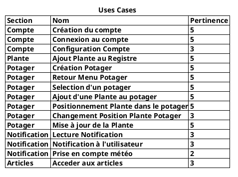

### Compte

#### Création du compte


##### Liste des objets candidats


- boundary : SignUpUI
- boundary : LoginUI
- control : SignUpWorkFlow
- entity : User
- participant : UserRepository


##### Description des interactions entre objets

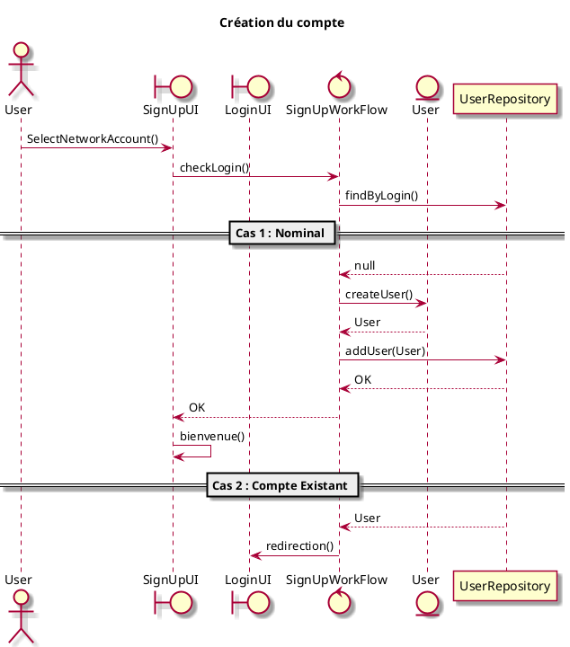

##### Diagramme de classe consolidé pour le Use case

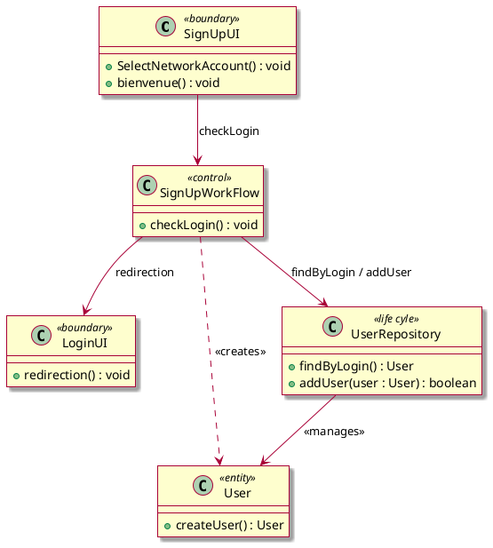


#### Connexion au compte

##### Liste des objets candidats


- boundary LoginUI
- boundary SignUpUI
- control LoginWorkFlow
- entity User
- participant UserRepository


##### Description des interactions entre objets
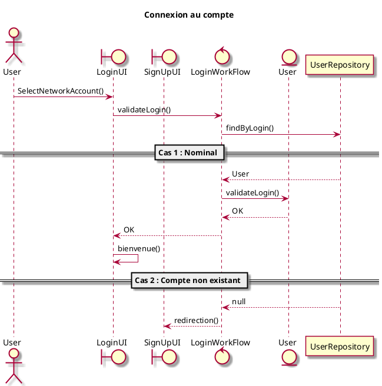

##### Diagramme de classe consolidé pour le Use case
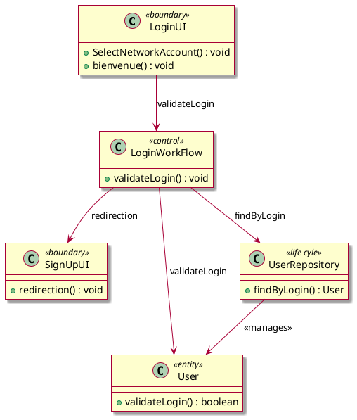


#### Configuration du compte

##### Liste des objets candidats

- boundary ProfileUI
- control ProfileWorkFlow 
- entity User 
- participant UserRepository 


##### Description des interactions entre objets

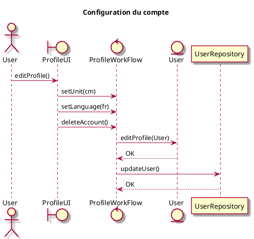

##### Diagramme de classe consolidé pour le Use case
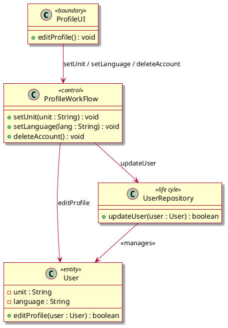


### Plante

#### Ajout d'une reference Plante au Registre

Le consultant va ajouter, modifier ou supprimer la base de donnée. pour ce faire, il passera directement par un logiciel externe (par exemple DB Browser for SQLite).


#### Ajout Plante utilisateur à son Compte

L'utilisateur va s'appuyer sur les references existantes pour ajouter une de ses plantes à son compte. Ces plantes pourrons ainsi etre plantées dans un potager de l'utilisateur.

##### Liste des objets candidats

- boundary AddPlantUI 
- control AddPlantWorkFlow 
- entity Plant 
- participant PlantRepository


##### Description des interactions entre objets

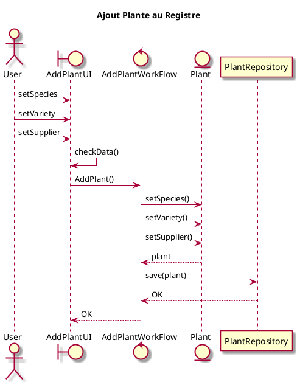

##### Diagramme de classe consolidé pour le Use case
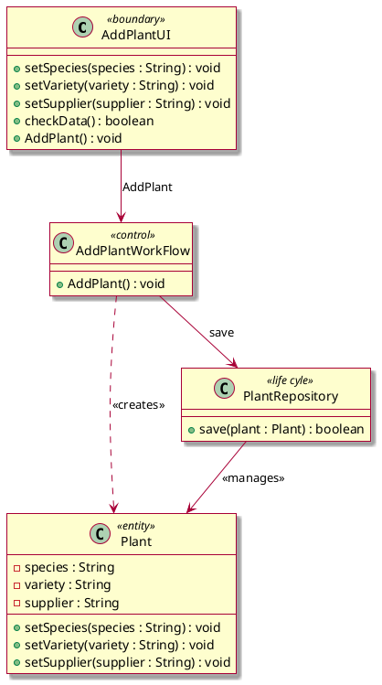


### Potager

#### Création Potager

##### Liste des objets candidats

- boundary GardenUI 
- boundary newGardenUI 
- boundary GardenUI[id]
- control GardenWorkFlow 
- entity Garden
- participant GardenRepository


##### Description des interactions entre objets


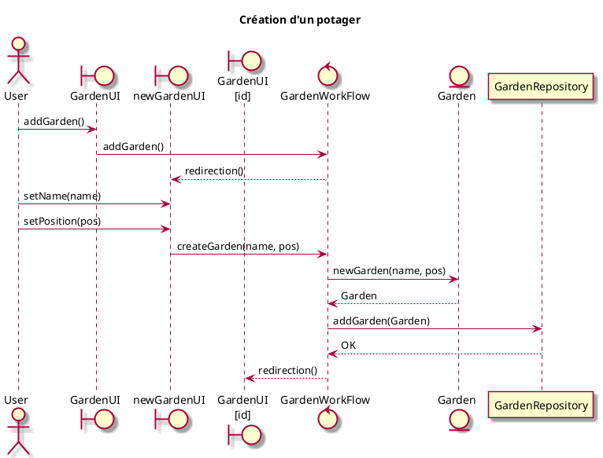


##### Diagramme de classe consolidé pour le Use case
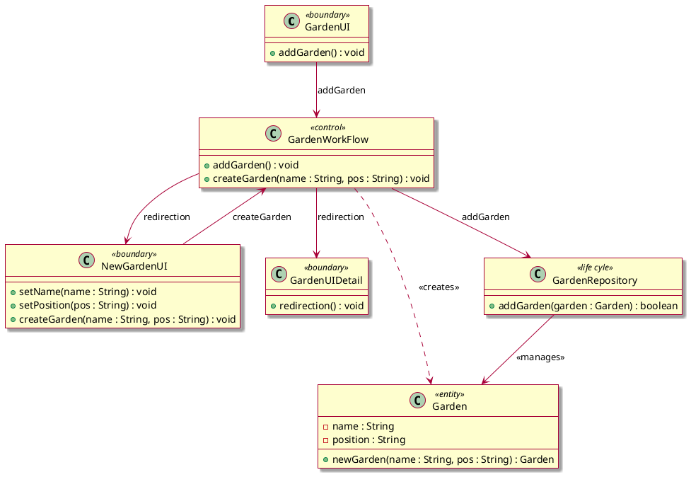

#### Création Potager

##### Liste des objets candidats

- boundary GardenUI[id]
- control GardenWorkFlow 
- entity Garden 
- participant GardenRepository


##### Description des interactions entre objets

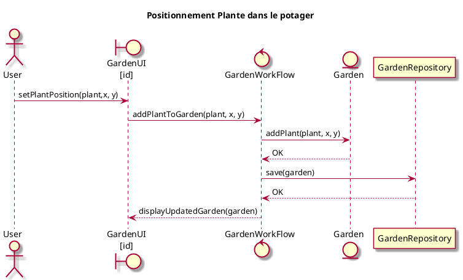


##### Diagramme de classe consolidé pour le Use case
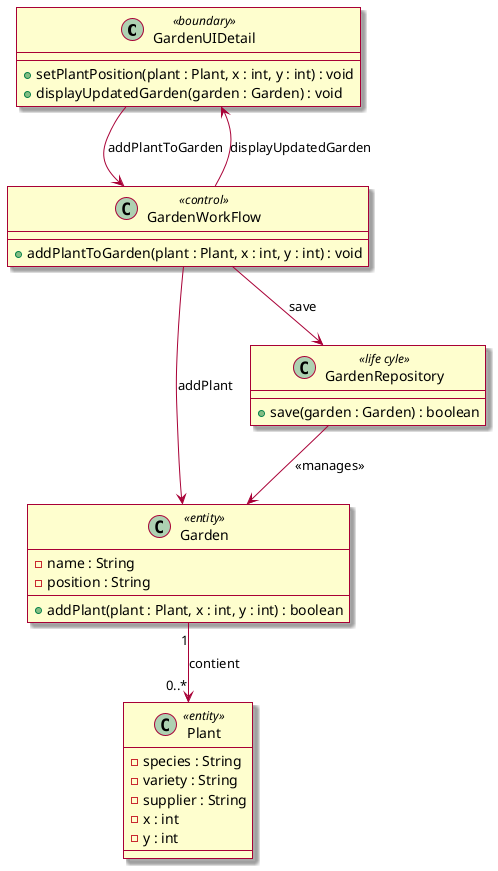

#### Retour Menu Potager

##### Liste des objets candidats

- boundary GardenUI[id]
- boundary GardenUI
- control GardenWorkFlow


##### Description des interactions entre objets
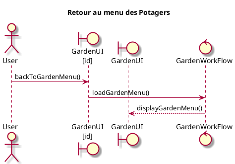

##### Diagramme de classe consolidé pour le Use case
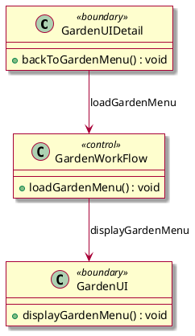

#### Selection d'un potager

##### Liste des objets candidats

- boundary GardenUI 
- boundary GardenUI[id]
- control GardenWorkFlow 
- entity Garden as enG
- participant GardenRepository


##### Description des interactions entre objets
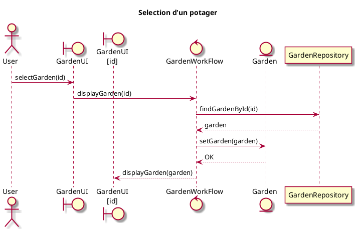


##### Diagramme de classe consolidé pour le Use case
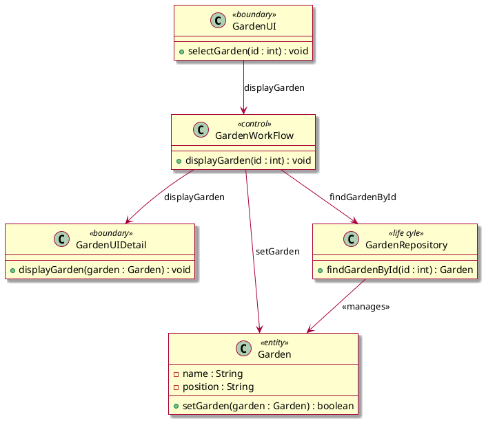


#### Ajout d'une Plante au potager

##### Liste des objets candidats

- boundary GardenUI as ui
- boundary PlantUI as uiP
- control GardenWorkFlow as wf
- control PlantWorkFlow as wfP
- entity Garden as enG
- entity Plant as enP
- participant GardenRepository as pG
- participant PlantRepository as pP


##### Description des interactions entre objets
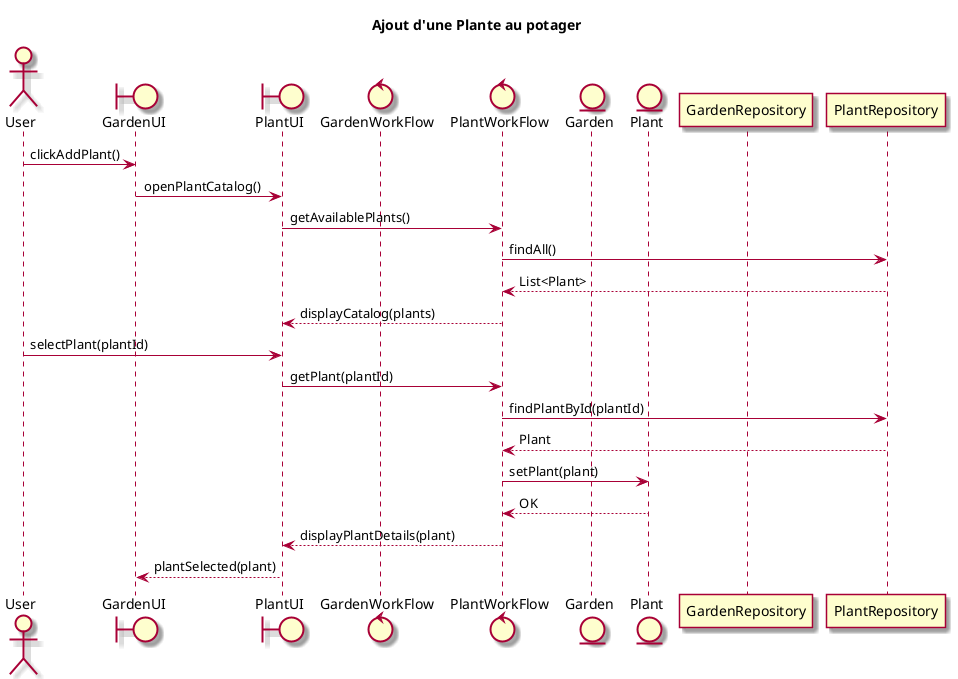


##### Diagramme de classe consolidé pour le Use case
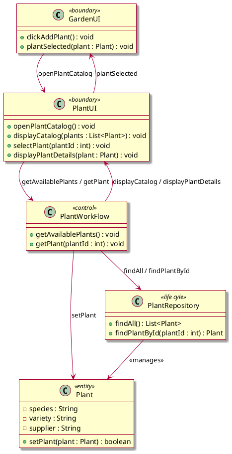

#### Changement Position Plante Potager

##### Liste des objets candidats

- boundary "GardenUI\n[id]" 
- control GardenWorkFlow 
- entity Garden
- participant GardenRepository


##### Description des interactions entre objets
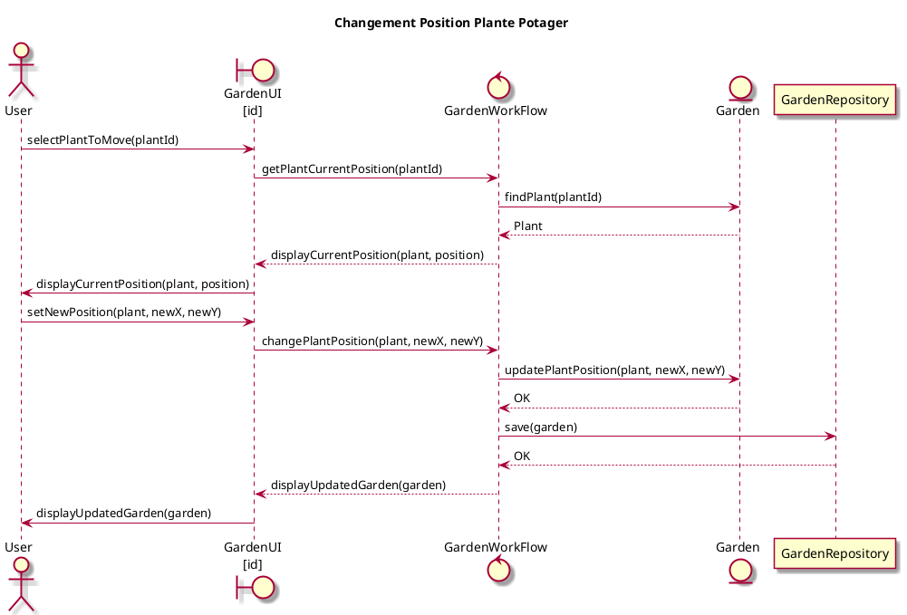


##### Diagramme de classe consolidé pour le Use case
```plantuml
@startuml
skin rose

class GardenUI <<boundary>> {
  + selectPlantToMove(plantId : int) : void
  + displayCurrentPosition(plant : Plant, position : Plant) : void
  + setNewPosition(plant : Plant, newX : int, newY : int) : void
  + displayUpdatedGarden(garden : Garden) : void
}

class GardenWorkFlow <<control>> {
  + getPlantCurrentPosition(plantId : int) : Plant
  + changePlantPosition(plant : Plant, newX : int, newY : int) : void
}

APONTE

class Garden <<entity>> {
  - name : String
  + findPlant(plantId : int) : Plant
  + updatePlantPosition(plant : Plant, newX : int, newY : int) : boolean
}

class Plant {
  - x : int
  - y : int
}

class Plant <<entity>> {
  - id : int
  - species : String
  - variety : String
}

class GardenRepository  <<life cyle>> {
  + save(garden : Garden) : boolean
}

GardenUI          --> GardenWorkFlow   : uses
GardenWorkFlow    --> Garden           : findPlant / updatePlant
GardenWorkFlow    --> GardenRepository : save
GardenRepository  --> Garden           : <<manages>>
Garden        "1" --> "0..*" Plant : contient

@enduml

```


#### Mise à jour de la Plante

##### Liste des objets candidats

- boundary "GardenUI\n[id]"
- control GardenWorkFlow
- entity Garden


##### Description des interactions entre objets
```plantuml
@startuml
title : Mise à jour Plante
skin rose

actor User as u
boundary "GardenUI\n[id]" as ui
control GardenWorkFlow as wf
entity Garden as enG

participant GardenRepository as pG

u -> ui : changePlantState(plant)
ui -> wf : getPlantState(plant)
wf --> ui : <List>state
ui -> u : displayAvailableStates(<List>state)
u -> ui : setPlantState(plant, state)
ui -> wf : setPlantState(plant, state)
wf -> enG : setPlantState(plant, state)
enG --> wf : OK
wf -> pG : save(garden)
pG --> wf : OK
wf --> ui : OK
ui -> u : displayUpdatedGarden(garden)

@enduml
```

##### Diagramme de classe consolidé pour le Use case
```plantuml
@startuml
skin rose

class GardenUIDetail <<boundary>> {
  + changePlantState(plant : Plant) : void
  + displayAvailableStates(states : List<PlantState>) : void
  + setPlantState(plant : Plant, state : PlantState) : void
  + displayUpdatedGarden(garden : Garden) : void
}

class GardenWorkFlow <<control>> {
  + getPlantState(plant : Plant) : List<PlantState>
  + setPlantState(plant : Plant, state : PlantState) : void
}

class Garden <<entity>> {
  - name : String
  - position : String
  + setPlantState(plant : Plant, state : PlantState) : boolean
}

class Plant <<entity>> {
  - species : String
  - variety : String
  - supplier : String
  - state : PlantState
}

enum PlantState {
  A_PLANTER
  PLANTEE
  A_RECOLTER
  RECOLTEE
}

class GardenRepository <<life cyle>> {
  + save(garden : Garden) : boolean
}

GardenUIDetail --> GardenWorkFlow : getPlantState / setPlantState
GardenWorkFlow --> Garden : setPlantState
GardenWorkFlow --> GardenRepository : save
GardenRepository --> Garden : <<manages>>
Garden "1" --> "0..*" Plant : contient
Plant --> PlantState : a un état

@enduml

```


### Notification
#### Lecture Notification

##### Liste des objets candidats

- boundary NotifUI
- control NotifWorkFlow
- entity UserNotif
- participant UserNotifRepository


##### Description des interactions entre objets
```plantuml
@startuml
title : Lecture Notification
skin rose

actor User as u
boundary NotifUI as ui
control NotifWorkFlow as wf
entity UserNotif as enG
participant UserNotifRepository as pG

u -> ui : readNotif()
ui -> wf : setNotifAsRead(Notif)
wf -> enG : updateNotification(Notif)
return OK
wf -> pG : update(Notif)
return OK
wf --> ui : update()
ui -> u : update()


@enduml
```
##### Diagramme de classe consolidé pour le Use case
```plantuml
@startuml
skin rose

class NotifUI <<boundary>> {
  + readNotif() : void
  + update() : void
}

class NotifWorkFlow <<control>> {
  + setNotifAsRead(notif : UserNotif) : void
}

class UserNotif <<entity>> {
  - id : Long
  - message : String
  - isRead : Boolean
  - createdAt : Date
  + updateNotification(notif : UserNotif) : void
  + isRead() : Boolean
}

class UserNotifRepository  <<life cyle>> {
  + update(notif : UserNotif) : void
}

NotifUI          --> NotifWorkFlow      : uses
NotifWorkFlow    --> UserNotif          : uses
NotifWorkFlow    --> UserNotifRepository : uses
UserNotifRepository --> UserNotif       : persists

@enduml

```

#### Notification utilisateur

##### Liste des objets candidats

- boundary NotifUI
- control NotifWorkFlow
- entity UserNotif
- participant UserNotifRepository

##### Description des interactions entre objets
```plantuml
@startuml
title : Notification utilisateur
skin rose

actor Systeme as s
boundary NotifUI as ui
control NotifWorkFlow as wf
entity UserNotif as enG
participant UserNotifRepository as pG

s -> wf : checkState()
return Notif
s -> wf : checkState()
return Notif

s -> wf : addNotif(<List>Notif)

wf -> enG : updateNotification(Notif)
return OK
wf -> pG : update(Notif)
return OK
wf --> ui : update()
ui -> s : update()

@enduml
```

##### Diagramme de classe consolidé pour le Use case
```plantuml
@startuml

skin rose

class NotifUI <<boundary>> {
  + update() : void
}

class NotifWorkFlow <<control>> {
  + checkState() : Notif
  + addNotif(notifs : List<Notif>) : void
}

class UserNotif <<entity>> {
  + updateNotification(notif : Notif) : boolean
}

class Notif <<entity>> {
  - message : String
  - type : String
  - date : Date
}

class UserNotifRepository {
  + update(notif : Notif) : boolean
}

NotifWorkFlow --> UserNotif : updateNotification
NotifWorkFlow --> UserNotifRepository : update
NotifWorkFlow --> NotifUI : update
UserNotif "1" --> "0..*" Notif : contient
UserNotifRepository --> UserNotif : <<manages>>

@enduml

```


### Articles
#### Accès aux articles

##### Liste des objets candidats

- boundary PlantUI
- control PlantWorkFlow
- entity Plant
- participant PlantRepository


##### Description des interactions entre objets

```plantuml
@startuml
title : Accès aux articles
skin rose

actor User as u
boundary PlantUI as ui
control PlantWorkFlow as wf
entity Plant as enG
participant PlantRepository as pG

u -> ui : getArticles(plant)
ui -> wf : getArticles(plant)
wf -> pG : findPlant(plant)
return plant
wf -> enG : getArticles()
enG --> wf : <List>Article
wf --> ui : <List>Article
ui --> u : displayArticles(<List>Article)

@enduml

```

##### Diagramme de classe consolidé pour le Use case
```plantuml
@startuml

skin rose

class PlantUI <<boundary>> {
  + getArticles(plant : Plant) : void
  + displayArticles(articles : List<Article>) : void
}

class PlantWorkFlow <<control>> {
  + getArticles(plant : Plant) : List<Article>
}

class Plant <<entity>> {
  - species : String
  - variety : String
  - supplier : String
  + getArticles() : List<Article>
}

class Article <<entity>>{
  - title : String
  - content : String
  - url : String
}

class PlantRepository {
  + findPlant(plant : Plant) : Plant
}

PlantUI --> PlantWorkFlow : getArticles
PlantWorkFlow --> PlantRepository : findPlant
PlantWorkFlow --> Plant : getArticles
PlantRepository --> Plant : <<manages>>
Plant "1" --> "0..*" Article : référence

@enduml

```


## Regroupement des classes


### Groupe domaine
```plantuml
@startuml
skin rose

class User <<entity>> {
  + createUser() : User
  + validateLogin() : boolean
  + editProfile(user : User) : boolean
  - unit : String
  - language : String
}

class Plant <<entity>> {
  - id : int
  - species : String
  - variety : String
  - supplier : String
  - state : PlantState
  - x : int
  - y : int
  + setSpecies(species : String) : void
  + setVariety(variety : String) : void
  + setSupplier(supplier : String) : void
  + setPlant(plant : Plant) : boolean
  + getArticles() : List<Article>
}

class Garden <<entity>> {
  - name : String
  - position : String
  + newGarden(name : String, pos : String) : Garden
  + addPlant(plant : Plant, x : int, y : int) : boolean
  + setGarden(garden : Garden) : boolean
  + findPlant(plantId : int) : Plant
  + updatePlantPosition(plant : Plant, newX : int, newY : int) : boolean
  + setPlantState(plant : Plant, state : PlantState) : boolean
}

class UserNotif <<entity>> {
  - id : Long
  - message : String
  - isRead : Boolean
  - createdAt : Date
  + updateNotification(notif : UserNotif) : void
  + isRead() : Boolean
  + updateNotification(notif : Notif) : boolean
}


class Notif <<entity>> {
  - message : String
  - type : String
  - date : Date
}

class Article <<entity>>{
  - title : String
  - content : String
  - url : String
}


UserNotif "1" --> "0..*" Notif : contient
Garden "1" --> "0..*" Plant : contient
Plant --> PlantState : a un état
Plant "1" --> "0..*" Article : référence

@enduml
```


### Groupe domaine et cycle de vie
```plantuml
@startuml
skin rose

class User <<entity>> {
  - unit : String
  - language : String
  + createUser() : User
  + validateLogin() : boolean
  + editProfile(user : User) : boolean
}


class Plant <<entity>> {
  - id : int
  - species : String
  - variety : String
  - supplier : String
  - state : PlantState
  - x : int
  - y : int
  + setSpecies(species : String) : void
  + setVariety(variety : String) : void
  + setSupplier(supplier : String) : void
  + setPlant(plant : Plant) : boolean
  + getArticles() : List<Article>
}

class Garden <<entity>> {
  - name : String
  - position : String
  + newGarden(name : String, pos : String) : Garden
  + addPlant(plant : Plant, x : int, y : int) : boolean
  + setGarden(garden : Garden) : boolean
  + findPlant(plantId : int) : Plant
  + updatePlantPosition(plant : Plant, newX : int, newY : int) : boolean
  + setPlantState(plant : Plant, state : PlantState) : boolean
}

class UserNotif <<entity>> {
  - id : Long
  - message : String
  - isRead : Boolean
  - createdAt : Date
  + updateNotification(notif : UserNotif) : void
  + isRead() : Boolean
  + updateNotification(notif : Notif) : boolean
}


class Notif <<entity>> {
  - message : String
  - type : String
  - date : Date
}

class Article <<entity>>{
  - title : String
  - content : String
  - url : String
}


class PlantRepository <<life cyle>> {
  + findPlant(plant : Plant) : Plant
}


class UserNotifRepository  <<life cyle>> {
  + update(notif : UserNotif) : void
}

class GardenRepository <<life cyle>> {
  + save(garden : Garden) : boolean
}

class GardenRepository  <<life cyle>> {
  + save(garden : Garden) : boolean
}

class PlantRepository <<life cyle>> {
  + findAll() : List<Plant>
  + findPlantById(plantId : int) : Plant
}

class GardenRepository <<life cyle>> {
  + findGardenById(id : int) : Garden
}


class GardenRepository <<life cyle>> {
  + addGarden(garden : Garden) : boolean
}

class PlantRepository <<life cyle>> {
  + save(plant : Plant) : boolean
}

class UserRepository <<life cyle>> {
  + updateUser(user : User) : boolean
}

class UserRepository <<life cyle>> {
  + findByLogin() : User
  + addUser(user : User) : boolean
}


class UserRepository <<life cyle>> {
  + findByLogin() : User
}


class GardenRepository <<life cyle>> {
  + save(garden : Garden) : boolean
}

class UserNotifRepository {
  + update(notif : Notif) : boolean
}


UserNotif "1" --> "0..*" Notif : contient
Garden "1" --> "0..*" Plant : contient
Plant --> PlantState : a un état
Plant "1" --> "0..*" Article : référence

PlantRepository --> Plant : <<manages>>
GardenRepository --> Garden : <<manages>>
UserNotifRepository --> UserNotif       : persists
UserNotifRepository --> UserNotif : <<manages>>
UserRepository --> User : <<manages>>

@enduml


```
### Groupe interface utilisateur et système
```plantuml
@startuml top to bottom direction
skin rose

class SignUpUI <<boundary>> {
  + SelectNetworkAccount() : void
  + bienvenue() : void
}

class LoginUI <<boundary>> {  
  + redirection() : void
}

class SignUpWorkFlow <<control>> {
  + checkLogin() : void
}

class LoginUI <<boundary>> {
  + SelectNetworkAccount() : void
  + bienvenue() : void
}

class SignUpUI <<boundary>> {
  + redirection() : void
}

class LoginWorkFlow <<control>> {
  + validateLogin() : void
}

class ProfileUI <<boundary>> {
  + editProfile() : void
}

class ProfileWorkFlow <<control>> {
  + setUnit(unit : String) : void
  + setLanguage(lang : String) : void
  + deleteAccount() : void
}

class AddPlantUI <<boundary>> {
  + setSpecies(species : String) : void
  + setVariety(variety : String) : void
  + setSupplier(supplier : String) : void
  + checkData() : boolean
  + AddPlant() : void
}

class AddPlantWorkFlow <<control>> {
  + AddPlant() : void
}

class GardenUI <<boundary>> {
  + addGarden() : void
}

class NewGardenUI <<boundary>> {
  + setName(name : String) : void
  + setPosition(pos : String) : void
  + createGarden(name : String, pos : String) : void
}

class GardenUIDetail <<boundary>> {
  + redirection() : void
}

class GardenWorkFlow <<control>> {
  + addGarden() : void
  + createGarden(name : String, pos : String) : void
}

class GardenUIDetail <<boundary>> {
  + setPlantPosition(plant : Plant, x : int, y : int) : void
  + displayUpdatedGarden(garden : Garden) : void
}

class GardenWorkFlow <<control>> {
  + addPlantToGarden(plant : Plant, x : int, y : int) : void
}

class GardenUIDetail <<boundary>> {
  + backToGardenMenu() : void
}

class GardenUI <<boundary>> {
  + displayGardenMenu() : void
}

class GardenWorkFlow <<control>> {
  + loadGardenMenu() : void
}

GardenUIDetail --> GardenWorkFlow : loadGardenMenu
GardenWorkFlow --> GardenUI : displayGardenMenu

class GardenUI <<boundary>> {
  + selectGarden(id : int) : void
}

class GardenUIDetail <<boundary>> {
  + displayGarden(garden : Garden) : void
}

class GardenWorkFlow <<control>> {
  + displayGarden(id : int) : void
}


class GardenUI <<boundary>> {
  + clickAddPlant() : void
  + plantSelected(plant : Plant) : void
}

class PlantUI <<boundary>> {
  + openPlantCatalog() : void
  + displayCatalog(plants : List<Plant>) : void
  + selectPlant(plantId : int) : void
  + displayPlantDetails(plant : Plant) : void
}

class PlantWorkFlow <<control>> {
  + getAvailablePlants() : void
  + getPlant(plantId : int) : void
}

class GardenUI <<boundary>> {
  + selectPlantToMove(plantId : int) : void
  + displayCurrentPosition(plant : Plant, position : Plant) : void
  + setNewPosition(plant : Plant, newX : int, newY : int) : void
  + displayUpdatedGarden(garden : Garden) : void
}

class GardenWorkFlow <<control>> {
  + getPlantCurrentPosition(plantId : int) : Plant
  + changePlantPosition(plant : Plant, newX : int, newY : int) : void
}

class GardenUIDetail <<boundary>> {
  + changePlantState(plant : Plant) : void
  + displayAvailableStates(states : List<PlantState>) : void
  + setPlantState(plant : Plant, state : PlantState) : void
  + displayUpdatedGarden(garden : Garden) : void
}

class GardenWorkFlow <<control>> {
  + getPlantState(plant : Plant) : List<PlantState>
  + setPlantState(plant : Plant, state : PlantState) : void
}


enum PlantState {
  A_PLANTER
  PLANTEE
  A_RECOLTER
  RECOLTEE
}


class NotifUI <<boundary>> {
  + readNotif() : void
  + update() : void
}

class NotifWorkFlow <<control>> {
  + setNotifAsRead(notif : UserNotif) : void
}


class NotifUI <<boundary>> {
  + update() : void
}

class NotifWorkFlow <<control>> {
  + checkState() : Notif
  + addNotif(notifs : List<Notif>) : void
}

class PlantUI <<boundary>> {
  + getArticles(plant : Plant) : void
  + displayArticles(articles : List<Article>) : void
}

class PlantWorkFlow <<control>> {
  + getArticles(plant : Plant) : List<Article>
}


GardenUI --> PlantUI : openPlantCatalog
PlantUI --> GardenUI : plantSelected
GardenUI          --> GardenWorkFlow   : uses
GardenUIDetail --> GardenWorkFlow : getPlantState / setPlantState
NotifUI          --> NotifWorkFlow      : uses
PlantUI --> PlantWorkFlow : getArticles
SignUpUI --> SignUpWorkFlow : checkLogin
LoginUI --> LoginWorkFlow : validateLogin
AddPlantUI --> AddPlantWorkFlow : AddPlant
GardenUI --> GardenWorkFlow : addGarden
GardenUI --> GardenWorkFlow : displayGarden
PlantUI --> PlantWorkFlow : getAvailablePlants / getPlant
NewGardenUI --> GardenWorkFlow : createGarden
PlantWorkFlow --> PlantUI : displayCatalog / displayPlantDetails
NotifWorkFlow --> NotifUI : update
SignUpWorkFlow --> LoginUI : redirection
LoginWorkFlow --> SignUpUI : redirection
GardenWorkFlow --> NewGardenUI : redirection
GardenWorkFlow --> GardenUIDetail : redirection
GardenWorkFlow --> GardenUIDetail : displayGarden
GardenWorkFlow --> GardenUIDetail : displayUpdatedGarden
GardenUIDetail --> GardenWorkFlow : addPlantToGarden

@enduml


```

## Annexes

### Terminologie


### Typologie des objets
**Entities** : modélisent les objets du métier
- portent la logique métier ;
- utilisent le vocabulaire métier ;
- ont un sens pour les experts métier ;

**Boundary** : interface entre un acteur et un use case.

**Control** : une par use case.
- fournit un WorkFlow spécifique à un objet « boundary » ;
- l’implémente en collaborant avec plusieurs objets « entity »
- Masque la complexité
- Façade
- n’a rien à voir avec le contrôleur du MVC (qui est un
Boundary).

**LifeCycle** Trouve/crée/détruit un type d’entités ; optionnel en analyse.
