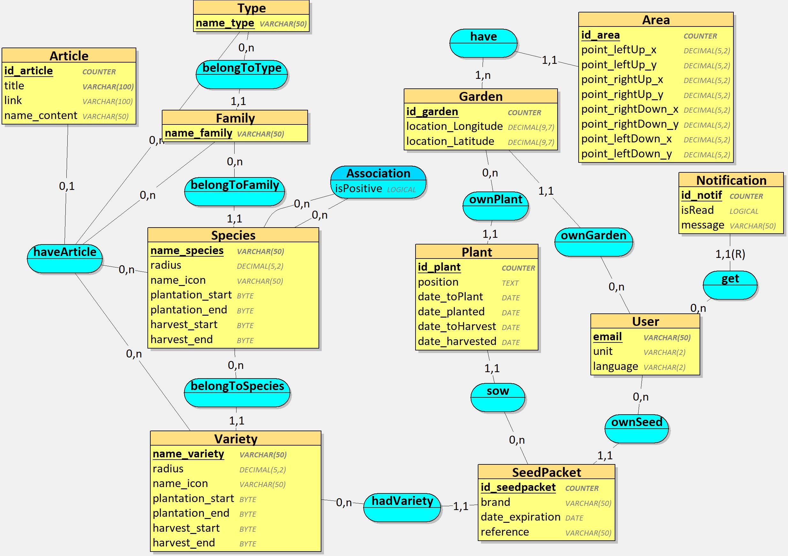
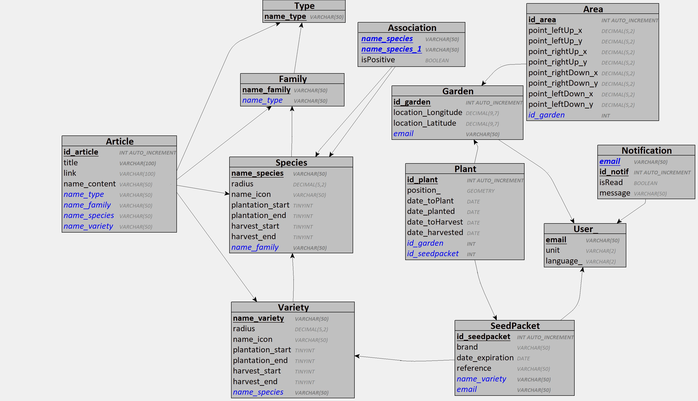

# Conception

## Table des matières

- [Conception](#conception)
  - [Table des matières](#table-des-matières)
  - [Terminologie](#terminologie)
  - [1. Objectif du document](#1-objectif-du-document)
  - [2. Architecture](#2-architecture)
    - [Contraintes techniques](#contraintes-techniques)
    - [Choix technologiques](#choix-technologiques)
      - [Administration du système](#administration-du-système)
      - [Côté clients](#côté-clients)
      - [Côté Consultant](#côté-consultant)
  - [3. Technologies utilisées](#3-technologies-utilisées)
    - [Serveur web](#serveur-web)
    - [Stockage des données](#stockage-des-données)
    - [Couche de persistance](#couche-de-persistance)
    - [Couche métier](#couche-métier)
    - [Couche service](#couche-service)
    - [Couche présentation](#couche-présentation)
    - [Authentification](#authentification)
    - [Environnement de développement](#environnement-de-développement)
    - [Test unitaire](#test-unitaire)
    - [Packages et dépendances](#packages-et-dépendances)
    - [Base de donnée](#base-de-donnée)
      - [Modele Conceptuel de Données (MCD)](#modele-conceptuel-de-données-mcd)
      - [Modele Logique de Données (MLD)](#modele-logique-de-données-mld)
    - [Sous-systèmes](#sous-systèmes)
    - [Déploiement](#déploiement)
  - [4. Cas d'utilisation](#4-cas-dutilisation)
    - [Compte](#compte)
      - [Connexion via Google (OAuth2 / OIDC)](#connexion-via-google-oauth2--oidc)
        - [Liste des objets candidats](#liste-des-objets-candidats)
        - [Description des interactions entre objets](#description-des-interactions-entre-objets)
        - [Diagramme de classe consolidé pour le Use case](#diagramme-de-classe-consolidé-pour-le-use-case)
      - [Session courante (`GET /api/auth/me`)](#session-courante-get-apiauthme)
        - [Liste des objets candidats](#liste-des-objets-candidats-1)
        - [Description des interactions entre objets](#description-des-interactions-entre-objets-1)
        - [Diagramme de classe consolidé pour le Use case](#diagramme-de-classe-consolidé-pour-le-use-case-1)
      - [Configuration du compte](#configuration-du-compte)
        - [Liste des objets candidats](#liste-des-objets-candidats-2)
        - [Description des interactions entre objets](#description-des-interactions-entre-objets-2)
        - [Diagramme de classe consolidé pour le Use case](#diagramme-de-classe-consolidé-pour-le-use-case-2)
    - [Plante](#plante)
      - [Ajout d'une référence Plante au Repertoire](#ajout-dune-référence-plante-au-repertoire)
      - [Consultation du répertoire](#consultation-du-répertoire)
        - [Liste des objets candidats](#liste-des-objets-candidats-3)
        - [Description des interactions entre objets](#description-des-interactions-entre-objets-3)
        - [Diagramme de classe consolidé pour le Use case](#diagramme-de-classe-consolidé-pour-le-use-case-3)
      - [Ajout Plante utilisateur à son Compte](#ajout-plante-utilisateur-à-son-compte)
        - [Liste des objets candidats](#liste-des-objets-candidats-4)
        - [Description des interactions entre objets](#description-des-interactions-entre-objets-4)
        - [Diagramme de classe consolidé pour le Use case](#diagramme-de-classe-consolidé-pour-le-use-case-4)
      - [Suppression d'une plante du compte](#suppression-dune-plante-du-compte)
        - [Liste des objets candidats](#liste-des-objets-candidats-5)
        - [Description des interactions entre objets](#description-des-interactions-entre-objets-5)
        - [Diagramme de classe consolidé pour le Use case](#diagramme-de-classe-consolidé-pour-le-use-case-5)
    - [Potager](#potager)
      - [Création Potager](#création-potager)
        - [Liste des objets candidats](#liste-des-objets-candidats-6)
        - [Description des interactions entre objets](#description-des-interactions-entre-objets-6)
        - [Diagramme de classe consolidé pour le Use case](#diagramme-de-classe-consolidé-pour-le-use-case-6)
      - [Positionnement Plante dans le potager](#positionnement-plante-dans-le-potager)
        - [Liste des objets candidats](#liste-des-objets-candidats-7)
        - [Description des interactions entre objets](#description-des-interactions-entre-objets-7)
        - [Diagramme de classe consolidé pour le Use case](#diagramme-de-classe-consolidé-pour-le-use-case-7)
      - [Retour Menu Potager](#retour-menu-potager)
        - [Liste des objets candidats](#liste-des-objets-candidats-8)
        - [Description des interactions entre objets](#description-des-interactions-entre-objets-8)
        - [Diagramme de classe consolidé pour le Use case](#diagramme-de-classe-consolidé-pour-le-use-case-8)
      - [Sélection d'un potager](#sélection-dun-potager)
        - [Liste des objets candidats](#liste-des-objets-candidats-9)
        - [Description des interactions entre objets](#description-des-interactions-entre-objets-9)
        - [Diagramme de classe consolidé pour le Use case](#diagramme-de-classe-consolidé-pour-le-use-case-9)
      - [Ajout d'une Plante au potager](#ajout-dune-plante-au-potager)
        - [Liste des objets candidats](#liste-des-objets-candidats-10)
        - [Description des interactions entre objets](#description-des-interactions-entre-objets-10)
        - [Diagramme de classe consolidé pour le Use case](#diagramme-de-classe-consolidé-pour-le-use-case-10)
      - [Changement Position Plante Potager](#changement-position-plante-potager)
        - [Liste des objets candidats](#liste-des-objets-candidats-11)
        - [Description des interactions entre objets](#description-des-interactions-entre-objets-11)
        - [Diagramme de classe consolidé pour le Use case](#diagramme-de-classe-consolidé-pour-le-use-case-11)
      - [Mise à jour de la Plante](#mise-à-jour-de-la-plante)
        - [Liste des objets candidats](#liste-des-objets-candidats-12)
        - [Description des interactions entre objets](#description-des-interactions-entre-objets-12)
        - [Diagramme de classe consolidé pour le Use case](#diagramme-de-classe-consolidé-pour-le-use-case-12)
      - [Renommer / Modifier un potager](#renommer--modifier-un-potager)
        - [Liste des objets candidats](#liste-des-objets-candidats-13)
        - [Description des interactions entre objets](#description-des-interactions-entre-objets-13)
        - [Diagramme de classe consolidé pour le Use case](#diagramme-de-classe-consolidé-pour-le-use-case-13)
      - [Suppression d'un potager](#suppression-dun-potager)
        - [Liste des objets candidats](#liste-des-objets-candidats-14)
        - [Description des interactions entre objets](#description-des-interactions-entre-objets-14)
        - [Diagramme de classe consolidé pour le Use case](#diagramme-de-classe-consolidé-pour-le-use-case-14)
      - [Ajout d'une zone (Area) au potager](#ajout-dune-zone-area-au-potager)
        - [Liste des objets candidats](#liste-des-objets-candidats-15)
        - [Description des interactions entre objets](#description-des-interactions-entre-objets-15)
        - [Diagramme de classe consolidé pour le Use case](#diagramme-de-classe-consolidé-pour-le-use-case-15)
      - [Modification d'une zone (Area)](#modification-dune-zone-area)
        - [Liste des objets candidats](#liste-des-objets-candidats-16)
        - [Description des interactions entre objets](#description-des-interactions-entre-objets-16)
        - [Diagramme de classe consolidé pour le Use case](#diagramme-de-classe-consolidé-pour-le-use-case-16)
      - [Suppression d'une zone (Area)](#suppression-dune-zone-area)
        - [Liste des objets candidats](#liste-des-objets-candidats-17)
        - [Description des interactions entre objets](#description-des-interactions-entre-objets-17)
        - [Diagramme de classe consolidé pour le Use case](#diagramme-de-classe-consolidé-pour-le-use-case-17)
      - [Retrait d'une plante du potager](#retrait-dune-plante-du-potager)
        - [Liste des objets candidats](#liste-des-objets-candidats-18)
        - [Description des interactions entre objets](#description-des-interactions-entre-objets-18)
        - [Diagramme de classe consolidé pour le Use case](#diagramme-de-classe-consolidé-pour-le-use-case-18)
    - [Notification](#notification)
      - [Lecture Notification](#lecture-notification)
        - [Liste des objets candidats](#liste-des-objets-candidats-19)
        - [Description des interactions entre objets](#description-des-interactions-entre-objets-19)
        - [Diagramme de classe consolidé pour le Use case](#diagramme-de-classe-consolidé-pour-le-use-case-19)
      - [Notification utilisateur](#notification-utilisateur)
        - [Liste des objets candidats](#liste-des-objets-candidats-20)
        - [Description des interactions entre objets](#description-des-interactions-entre-objets-20)
        - [Diagramme de classe consolidé pour le Use case](#diagramme-de-classe-consolidé-pour-le-use-case-20)
    - [Articles](#articles)
      - [Accès aux articles](#accès-aux-articles)
        - [Liste des objets candidats](#liste-des-objets-candidats-21)
        - [Description des interactions entre objets](#description-des-interactions-entre-objets-21)
        - [Diagramme de classe consolidé pour le Use case](#diagramme-de-classe-consolidé-pour-le-use-case-21)
  - [5. Regroupement des classes](#5-regroupement-des-classes)
    - [Groupe domaine](#groupe-domaine)
    - [Groupe domaine et cycle de vie](#groupe-domaine-et-cycle-de-vie)
    - [Groupe Service](#groupe-service)
    - [Groupe interface utilisateur et système](#groupe-interface-utilisateur-et-système)
  - [6. Annexes](#6-annexes)
    - [Script Langage de Définition des Données (LDD)](#script-langage-de-définition-des-données-ldd)
    - [Correspondance Arrington → Spring Boot](#correspondance-arrington--spring-boot)

---

## Terminologie

| Terme           | Définition                                                                                                                                                                         |
| ----------------- | ------------------------------------------------------------------------------------------------------------------------------------------------------------------------------------- |
| @Entity         | Annotation JPA marquant une classe comme entité persistée en base de données                                                                                                     |
| @Repository     | Interface Spring Data JPA héritant de JpaDAO, génère automatiquement les requêtes CRUD                                                                                          |
| @Service        | Bean Spring gérant la logique métier, correspondant aux WorkFlows de l'analyse Arrington                                                                                          |
| @RestController | Bean Spring MVC gérant les requêtes HTTP REST, retourne du JSON (ResponseEntity<DTO>). Équivaut à @Controller + @ResponseBody. Correspond aux boundaries de l'analyse Arrington |
| Vue.js          | Framework JavaScript SPA (Single Page Application) — le frontend communique avec le backend via l'API REST. Le routage est géré par Vue Router côté client                     |
| DTO             | *Data Transfer Object* : objet de transfert entre couches, évite l'exposition directe des entités JPA                                                                             |
| JPA             | *Java Persistence API* : standard Java pour la persistance des données relationnelles                                                                                              |
| Spring Data JPA | Surcouche Spring simplifiant l'utilisation de JPA via des repositories déclarés                                                                                                   |
| @Scheduled      | Annotation Spring permettant l'exécution planifiée de méthodes (tâches de fond, ici pour les notifications)                                                                     |
| GardenPlant     | Entité de jointure entre Garden et Plant, portant les coordonnées (x, y) et l'état de la plante dans un potager donné                                                           |
| Plant           | Plante appartenant à un utilisateur. Stocke uniquement variety (nom de la variété choisie dans le registre) et supplier. Le champ species n'est pas dupliqué ici car il est dérivable via Variety → Species dans le package Registry. **Divergence LDD** : en SQL, la table SeedPacket joue ce rôle ; la table Plant SQL correspond à GardenPlant Java (instance placée dans le potager). |
| GardenPlant     | Instance d'une plante placée dans un potager, portant les coordonnées (x, y) et l'état. **Divergence LDD** : la table SQL Plant porte ce concept (via position_ GEOMETRY). L'entité GardenPlant est une décomposition Java délibérée pour séparer le "paquet de graines" de son "placement physique". |
| Notification    | **Divergence LDD partielle** : le LDD utilise une PK composite (email, notifId) et ne définit que message et isRead. Le modèle Java conserve une PK surrogate (@Id id) et ajoute type et createdAt, utiles à l'affichage et au tri applicatif. |

## 1. Objectif du document

Ce document aborde la conception et les choix techniques pour l'implémentation du projet « PlanPotager ».
Les diagrammes suivent le langage de modélisation UML et la méthodologie Arrington.

## 2. Architecture

### Contraintes techniques

Parce que les potagers sont en extérieur et qu'une modification peut se faire dans la minute, il est impératif de pouvoir éditer facilement et rapidement la configuration de l'utilisateur. Le smartphone est donc privilégié dans ce cas.

Parce que l'application doit également permettre un travail efficace et posé pour la création d'un potager, il est intéressant pour l'utilisateur de pouvoir gérer sa configuration sur un écran plus grand. Le PC est donc privilégié dans ce cas.

Cela implique un cross-plateforme Smartphone (Android) et PC (Windows). De ce fait, la sauvegarde doit être enregistrée sur un serveur commun.

Afin de protéger la vie privée des utilisateurs et de leurs données privées (email, ville), l'application doit être raisonnablement sécurisée.

### Choix technologiques

Il est bien entendu possible de sélectionner plusieurs technologies différentes pour un même type de couches. On peut par exemple avoir une application qui travaille avec un client lourd pour certaines fonctionnalités, et un client web pour d'autres. Mais ça a évidemment un coût.

Les points à considérer sont en particulier :

* la complexité de l'interface utilisateur ;
* les contraintes de déploiement ;
* le nombre et le type d'utilisateurs ;
* l'interaction avec le système ;
* les performances ;
* le passage à l'échelle ;
* la sécurité

#### Administration du système

on est essentiellement dans du CRUD ;
le système peut être administré en interne ;
il y a un administrateur ;
on veut que ça soit suffisamment sécurisé.

Le nombre d'utilisateurs attendus est assez faible ; il pourrait y avoir beaucoup de clients, mais ça n'est pas le cas actuellement.

#### Côté clients

L'interface doit être assez simple et intuitive, nottament pour permettre aux seniors de pouvoir l'utiliser sans se prendre la tête. Elle doit etre responsive pour être adaptée tant sur smarphone (icone "Ajouter comme application") que sur Ordinateur.

#### Côté Consultant

Le consultant va ajouter, modifier ou supprimer la base de donnée. pour ce faire, il passera directement par un logiciel externe (par exemple DBeaver).

## 3. Technologies utilisées

### Serveur web

**Spring Boot** avec serveur embarqué **Tomcat**.

Spring Boot permet de simplifier la création d'applications web autonomes en y intégrant Tomcat. L'application est packagée sous forme de JAR exécutable. L'application sera dans un premier temps testé en local avant d'être déployée sur un VPS pour une version beta.

Le projet sera lancé sur 2 dockers qui gererons chacun leur base de donnée afin de ne pas impacter les resultats. l'un pour réaliser les tests unitaires et l'autre pour lancer l'application.

### Stockage des données

L'historique du potager doit pouvoir se garder sur des années afin de vérifier l'évolution et éviter la perte de données de l'utilisateur. Un accès aux données anyonyme est également indispensable pour des statistiques et affiner au fur et à mesure, les conseils de plantation en fonction des retours utilisateurs et des associations.

Il est donc choisi que la base de données soit à distance avec une copie locale en cas de probleme de connexion.

Le choix se porte sur MySQL car celui-ci permet la gestion sur serveur et est tout indiqué pour la gestion mutli-utilisateur

Afin de faciliter l'accès à la base de données pour le consultant, il sera mis à disposition, le logiciel gratuit 'DBeaver'

### Couche de persistance

définition : permet de faire la liaison entre :

* les objets, leurs propriétés et méthodes de persistance
* les tables, leurs colonnes, index et relations d'intégrité

**Spring Data JPA** avec **Hibernate** comme implémentation JPA.

Correspondance Arrington :

- **entity** → classes annotées @Entity (Hibernate/JPA) : User, Plant, Garden, GardenPlant, Notification, Article
- **life cycle** → interfaces héritant de JpaDAO<T, ID> annotées @Repository

Spring Data JPA génère automatiquement les implémentations CRUD à partir des interfaces déclarées. Les requêtes personnalisées sont exprimées via les conventions de nommage (findBy...) ou l'annotation @Query.

### Couche métier

**Spring Service** [@Service].

Correspondance Arrington :

- **control (WorkFlow)** → classes annotées @Service

Les services implémentent la logique métier, orchestrent les appels aux repositories, appliquent les règles de validation et préparent les données pour les controllers. Ils constituent la façade métier de l'application. Les méthodes de modification sont annotées @Transactional.

### Couche service

Les échanges entre la couche présentation (Controller) et la couche métier (Service) se font via des **DTOs** (Data Transfer Objects) pour éviter l'exposition directe des entités JPA et découpler les couches.

### Couche présentation

**Vue.js** (frontend SPA) + **Spring MVC (@RestController)** (backend REST API).

Correspondance Arrington :

- **boundary (UI)** → composants Vue (.vue) côté frontend
- **boundary (API)** → classes annotées @RestController côté backend

Le frontend Vue est indépendant et communique avec le backend Spring Boot via une **API REST JSON**. Les controllers Spring retournent du JSON (ResponseEntity<DTO>) et non des vues HTML. Le routage entre pages est géré côté client par **Vue Router**.

Correspondance boundaries → composants Vue :

| Boundary (analyse) | Composant Vue           | Route           |
| -------------------- | ------------------------- | ----------------- |
| LoginUI            | Auth/Login.vue          | /login (déclenche `GET /oauth2/authorization/google`) |
| ProfileUI          | Profile/Profile.vue     | /profile        |
| AddPlantUI         | Plant/AddPlant.vue      | /plant/add      |
| PlantUI            | Plant/Registry.vue      | /plant/Registry |
| GardenUI           | Garden/GardenList.vue   | /garden         |
| NewGardenUI        | Garden/NewGarden.vue    | /garden/new     |
| GardenStructureUI  | Garden/GardenStructure.vue | /garden/:id/structure |
| GardenDetailUI   | Garden/GardenDetail.vue  | /garden/:id/plants    |
| NotifUI            | Notif/NotifList.vue       | /notif          |
| ArticleUI          | Article/ArticleList.vue   | /article        |
| RegistryUI         | Registry/CatalogView.vue  | /catalog        |

### Authentification

L'authentification est **déléguée à un fournisseur d'identité externe** (Google en Phase 1, Facebook différé à une phase ultérieure) via **OAuth 2.0 / OpenID Connect (OIDC)**. PlanPotager tient le rôle de **client OAuth2 (relying party)** — jamais celui de fournisseur d'identité/serveur d'autorisation — et ne reçoit ni ne stocke aucun mot de passe utilisateur. L'identité de l'utilisateur (email, statut `email_verified`) est portée par l'**ID Token** signé que Google renvoie ; Spring Security prend nativement en charge ce mécanisme via `oauth2Login()`.

### Environnement de développement

- **Langage** : Java 25
- **Build** : Gradle Groovy
- **IDE** : Visual Studio Code
- **Gestion de version** : GitLab
- **Administration BDD** : DBeaver

### Test unitaire

- **JUnit 5** : framework de tests unitaires

### Packages et dépendances

L'application PlanPotager est structurée en une architecture MVC en couches, conforme au modèle Spring Boot.

**Correspondance Arrington → Spring Boot :**

| Appellation Arrington | Technologie Spring Boot                     |
| ----------------------- | --------------------------------------------- |
| entity                | Entité JPA (Hibernate)                     |
| lifecycle (Repository)| DAO Spring Data                             |
| control (WorkFlow)    | Service Spring                              |
| boundary (UI)         | @RestController (Spring MVC) + Vue.js (SPA) |

Chaque sous-système fonctionnel (authentification, plantes, potagers, notifications) est organisé selon les mêmes quatre couches :

~~~plantuml
@startuml
hide empty members
left to right direction
package "PlanPotager" {

  package "User" #LightBlue {
    package "dao" as daoU {
      interface UserDAO <<@Repository>>
    }
    package "dto" as dtoU {
      class UserDTO
    }
    package "service" as sU {
      class AuthService <<@Service>>
      class ProfileService <<@Service>>
    }
    package "domain" as dU {
      class User <<@Entity>>
    }
    package "ui" as uiU {
      class AuthController <<@RestController>>
      class ProfileController <<@RestController>>
    }
    uiU ..> sU : appelle
    sU ..> dtoU  : créé
    dtoU ..> uiU  : retourne
    sU ..> daoU  : appelle
    daoU ..> dU  : gère (JPA)
  }

  package "Registry" #b47c7c {
    package "dao" as daoR {

      interface TypeDAO <<@Repository>>
      interface FamilyDAO <<@Repository>>
      interface SpeciesDAO <<@Repository>>
      interface VarietyDAO <<@Repository>>
      interface AssociationDAO <<@Repository>>
    }
    package "dto" as dtoR {
      class TypeDTO
      class FamilyDTO
      class SpeciesDTO
      class VarietyDTO
    }
    package "service" as sR {
      class RegistryService <<@Service>>
    }
    package "domain" as dR {
      class Type <<@Entity>>
      class Family <<@Entity>>
      class Species <<@Entity>>
      class Variety <<@Entity>>
      class Association <<@Entity>>
    }
    package "ui" as uiR{
      class RegistryController <<@RestController>>
    }
    uiR ..> sR : appelle
    sR ..> dtoR  : créé
    dtoR ..> uiR : retourne
    sR ..> daoR : appelle
    daoR ..> dR : gère (JPA)
  }

  package "Garden" #LightGreen {
    package "dao" as daoG {
      interface GardenDAO <<@Repository>>
      interface AreaDAO <<@Repository>>
      interface PlantDAO <<@Repository>>
    }
    package "dto" as dtoG {
      class GardenDTO
      class AreaDTO
      class PlantDTO
    }
    package "service" as sG {
      class GardenService <<@Service>>
    }
    package "domain" as dG {
      class Garden <<@Entity>>
      class Area <<@Entity>>
      class Plant <<@Entity>>
    }
    package "ui" as uiG {
      class GardenController <<@RestController>>
    }

    uiG ..> sG : appelle
    sG ..> dtoG  : créé
    dtoG ..> uiG : retourne
    sG ..> daoG : appelle
    daoG ..> dG : gère (JPA)
  }

  package "Notification"  #LightGrey {
    package "dao" as daoN {
      interface NotificationDAO <<@Repository>>
    }
    package "dto" as dtoN {
      class NotifDTO
    }
    package "service" as sN {
      class NotifService <<@Service>>
      class NotifScheduler <<@Component>>
    }
    package "domain" as dN {
      class Notification <<@Entity>>
    }
    package "ui" as uiN {
      class NotifController <<@RestController>>
    }

    uiN ..> sN : appelle
    sN ..> dtoN  : créé
    dtoN ..> uiN : retourne
    sN ..> daoN : appelle
    daoN ..> dN : gère (JPA)
  }

  package "Article" #LightYellow {
    package "dao" as daoA {
      interface ArticleDAO <<@Repository>>
    }
    package "dto" as dtoA {
      class ArticleDTO
    }
    package "service" as sA  {
      class ArticleService <<@Service>>
    }
    package "domain" as dA {
      class Article <<@Entity>>
    }
    package "ui" as uiA {
      class ArticleController <<@RestController>>
    }

    uiA ..> sA : appelle
    sA ..> dtoA  : créé
    dtoA ..> uiA : retourne
    sA ..> daoA : appelle
    daoA ..> dA : gère (JPA)
  }

}

@enduml
~~~

### Base de donnée

La génération du MLD et du LDD (en annexe), depuis le MCD à été réalisé avec le logiciel Looping 4.1.

#### Modele Conceptuel de Données (MCD)

#### Modele Logique de Données (MLD)

### Sous-systèmes

L'application est découpée en sous-systèmes fonctionnels correspondant aux domaines métier identifiés lors de l'analyse :

| Sous-système    | Controller(s)     | Service(s)                   | Description                            |
| ------------------ | ------------------- | ------------------------------ | ---------------------------------------- |
| Authentification | AuthController    | AuthService                  | Création de compte, connexion         |
| Profil           | ProfileController | ProfileService               | Configuration du compte utilisateur    |
| Répertoire       | RegistryController | RegistryService             | Consultation du catalogue botanique    |
| Plante           | PlantController   | PlantService                 | Gestion des plantes de l'utilisateur   |
| Potager          | GardenController  | GardenService                | Gestion des potagers et positionnement |
| Notification     | NotifController   | NotifService, NotifScheduler | Gestion et envoi des notifications     |
| Article          | ArticleController | ArticleService               | Consultation des articles informatifs  |

### Déploiement

~~~plantuml
@startuml
title Diagramme de déploiement - PlanPotager
skin rose

actor "Utilisateur PC" as userPC
actor "Utilisateur Mobile" as userMobile
actor "Consultant" as consultant

cloud "Google\n(Identity Provider OIDC)" as google

node "Client PC (Windows)" {
  component "Navigateur Web" as browserPC {
    component "Vue.js SPA" as vuePC
  }
}

node "Client Mobile (Android)" {
  component "Navigateur Mobile" as browserMobile {
    component "Vue.js SPA" as vueMobile
  }
}

node "Poste Consultant" {
  component "DBeaver" as dbeaver
}

node "Serveur (VPS / local)" {

  node "Docker : Application" {
    component "Spring Boot (Tomcat embarqué)" as app {
      component "Spring Security\n(OAuth2 Client / OIDC)" as security
      component "RestControllers (@RestController)" as mvc
      component "Services (@Service)" as svc
      component "NotifScheduler (@Scheduled)" as scheduler
      component "Repositories (Spring Data JPA)" as jpa
    }
    database "MySQL\n(application)" as dbApp
  }

  node "Docker : Tests" {
    component "JUnit 5" as junit
    database "MySQL\n(tests)" as dbTest
  }

}

userPC --> browserPC
userMobile --> browserMobile
consultant --> dbeaver

vuePC --> security : HTTPS / API REST JSON
vueMobile --> security : HTTPS / API REST JSON
security --> mvc
security <--> google : redirection OAuth2 login\n+ callback (code, puis ID Token)
jpa --> dbApp : JDBC / Hibernate
junit --> dbTest : JDBC / Hibernate
dbeaver --> dbApp : JDBC (accès direct)

scheduler --> svc : déclenche (cron 8h00)

@enduml
~~~

---

## 4. Cas d'utilisation

### Compte

⚠️ Cette section a remplacé le flux de signup/login par email (obsolète) suite à la correction de trajectoire documentée dans `temp/arrangement-oauth2-auth.md` : PlanPotager délègue entièrement l'authentification à Google (OAuth2/OIDC), il n'existe plus d'endpoint applicatif `POST /api/auth/signup` ni `POST /api/auth/login`.

#### Connexion via Google (OAuth2 / OIDC)

##### Liste des objets candidats

| Analyse (Arrington)             | Vue.js (Frontend) | Spring Boot (Backend)  | Annotation                             |
| -------------------------------- | ------------------ | ------------------------ | ---------------------------------------- |
| LoginUI (boundary)              | Auth/Login.vue     | —                        | redirection native Spring Security      |
| CustomOidcUserService (control) | —                  | CustomOidcUserService   | @Service (implémente `OidcUserService`) |
| AuthService (control)           | —                  | AuthService             | @Service                                |
| User (entity)                   | —                  | User                    | @Entity                                 |
| UserDAO (life cycle)            | —                  | UserDAO                 | @Repository                             |

##### Description des interactions entre objets

~~~plantuml
@startuml
title Connexion via Google - Délégation OAuth2/OIDC
skin rose

actor User as u
boundary "Auth/Login.vue\n(Vue.js)" as vue
participant "Spring Security\n(oauth2Login)" as sec
boundary "Google (IdP)" as google
control "CustomOidcUserService" as oidc
control "AuthService <<@Service>>" as svc
participant "UserDAO <<@Repository>>" as repo

u -> vue : clique "Se connecter avec Google"
vue -> sec : GET /oauth2/authorization/google
sec -> google : redirection (consentement)
google --> u : écran de consentement Google
u -> google : accepte
google -> sec : callback /login/oauth2/code/google\n+ code d'autorisation
sec -> google : échange code -> ID Token + claims\n(email, email_verified, sub)
sec -> oidc : loadUser(OidcUserRequest)
oidc -> oidc : vérifie email_verified == true

alt email non vérifié
oidc --> sec : OAuth2AuthenticationException
sec --> vue : redirection échec authentification

else email vérifié
oidc -> svc : checkEmail(email)
svc -> repo : findByEmail(email)

alt compte existant
repo --> svc : Optional<User>
svc --> oidc : Optional<User>
oidc -> svc : updateProvider(email, provider, providerId)\n(fusion silencieuse si l'IdP diffère de celui enregistré)

else compte inexistant
repo --> svc : Optional.empty()
svc --> oidc : Optional.empty()
oidc -> svc : createUser(email, provider, providerId)
svc -> repo : save(User)
svc --> oidc : UserDTO

end

oidc --> sec : OidcUser (claims Google)
sec -> sec : ouvre la session (cookie)
sec --> vue : redirection /garden

end

@enduml
~~~

##### Diagramme de classe consolidé pour le Use case

~~~plantuml
@startuml
skin rose

class CustomOidcUserService <<@Service>> {
  + loadUser(userRequest : OidcUserRequest) : OidcUser
}

class AuthService <<@Service>> {
  + checkEmail(email : String) : Optional<User>
  + createUser(email : String, provider : String, providerId : String) : UserDTO
  + updateProvider(email : String, provider : String, providerId : String) : UserDTO
}

class User <<@Entity>> {
  @Id
  - email : String
  - unit : String
  - language : String
  - provider : String
  - providerId : String
}

interface UserDAO <<@Repository>> {
  + findByEmail(email : String) : Optional<User>
  + save(user : User) : User
}

CustomOidcUserService "1" --> "1" AuthService
AuthService "1" --> "1" UserDAO
UserDAO "1" ..> "0..*" User

@enduml
~~~

---

#### Session courante (`GET /api/auth/me`)

Il n'y a plus de flux de login applicatif distinct : l'authentification elle-même est entièrement gérée par la redirection Google décrite ci-dessus. Ce use case couvre uniquement la question "la session est-elle active, et pour quel utilisateur ?", posée par la SPA à son chargement.

##### Liste des objets candidats

| Analyse (Arrington)      | Vue.js (Frontend)       | Spring Boot (Backend) | Annotation      |
| -------------------------- | ------------------------ | --------------------- | --------------- |
| AuthController (boundary) | App.vue (au chargement) | AuthController        | @RestController |
| ProfileService (control)  | —                        | ProfileService        | @Service        |
| User (entity)             | —                        | User                  | @Entity         |
| UserDAO (life cycle)      | —                        | UserDAO               | @Repository     |

##### Description des interactions entre objets

~~~plantuml
@startuml
title Session courante - GET /api/auth/me
skin rose

actor User as u
boundary "App.vue\n(Vue.js)" as vue
boundary "AuthController <<@RestController>>" as ctrl
control "ProfileService <<@Service>>" as svc
participant "UserDAO <<@Repository>>" as repo

vue -> ctrl : GET /api/auth/me\n(cookie de session)

alt authentifié
ctrl -> svc : getProfile(principal.email)
svc -> repo : findByEmail(email)
repo --> svc : Optional<User>
svc --> ctrl : UserDTO
ctrl --> vue : 200 OK\n{ UserDTO }

else non authentifié
ctrl --> vue : 401 Unauthorized
vue -> vue : redirect Vue Router /login

end

@enduml
~~~

##### Diagramme de classe consolidé pour le Use case

~~~plantuml
@startuml
skin rose

class AuthController <<@RestController>> {
  + me(principal : OidcUser) : ResponseEntity<UserDTO>
}

class ProfileService <<@Service>> {
  + getProfile(userEmail : String) : UserDTO
}

class User <<@Entity>> {
  @Id
  - email : String
  - unit : String
  - language : String
  - provider : String
  - providerId : String
}

interface UserDAO <<@Repository>> {
  + findByEmail(email : String) : Optional<User>
}

AuthController "1" --> "1" ProfileService
ProfileService "1" --> "1" UserDAO
UserDAO "1" ..> "0..*" User

@enduml
~~~

---

#### Configuration du compte

##### Liste des objets candidats

| Analyse (Arrington)       | Vue.js (Frontend)      | Spring Boot (Backend) | Annotation      |
| --------------------------- | ---------------------- | --------------------- | --------------- |
| ProfileUI (boundary)      | Profile/Profile.vue    | ProfileController     | @RestController |
| ProfileWorkFlow (control) | —                      | ProfileService        | @Service        |
| User (entity)             | —                      | User                  | @Entity         |
| UserDAO (life cycle)      | —                      | UserDAO               | @Repository     |

##### Description des interactions entre objets

~~~plantuml
@startuml
title Configuration du compte - API REST + Vue.js
skin rose

actor User as u
boundary "Profile/Profile.vue\n(Vue.js)" as vue
boundary "ProfileController <<@RestController>>" as ctrl
control "ProfileService <<@Service>>" as svc
entity "User <<@Entity>>" as en
participant "UserDAO <<@Repository>>" as repo

== Consulter le profil ==

u -> vue : (chargement de la page)
vue -> ctrl : GET /api/profile
ctrl -> svc : getProfile(userEmail)
svc -> repo : findByEmail(userEmail)
repo --> svc : Optional<User>
svc --> ctrl : UserDTO
ctrl --> vue : 200 OK\n{ UserDTO }

== Modifier le profil ==

u -> vue : modifie unit / language et soumet
vue -> ctrl : PUT /api/profile\n{ unit, language }
ctrl -> svc : updateProfile(userId, unit, language)
svc -> repo : findByEmail(userEmail)
repo --> svc : Optional<User>
svc -> en : setUnit(unit)
svc -> en : setLanguage(language)
svc -> repo : save(user)
repo --> svc : User
svc --> ctrl : UserDTO
ctrl --> vue : 200 OK\n{ UserDTO }

== Supprimer le compte ==

u -> vue : demande suppression du compte
vue -> ctrl : DELETE /api/profile
ctrl -> svc : deleteAccount(userId)
svc -> repo : findByEmail(userEmail)
repo --> svc : Optional<User>
svc -> repo : delete(user)
svc --> ctrl : void
ctrl --> vue : 204 No Content
vue -> vue : redirect Vue Router /login

@enduml
~~~

##### Diagramme de classe consolidé pour le Use case

~~~plantuml
@startuml
skin rose

class ProfileController <<@RestController>> {
  + getProfile() : ResponseEntity<UserDTO>
  + editProfile(@RequestBody unit : String, language : String) : ResponseEntity<UserDTO>
  + deleteAccount() : ResponseEntity<Void>
}

class ProfileService <<@Service>> {
  + getProfile(userEmail : String) : UserDTO
  + updateProfile(userEmail : String, unit : String, language : String) : UserDTO
  + deleteAccount(userEmail : String) : void
}

class User <<@Entity>> {
  @Id
  - email : String
  - unit : String
  - language : String
  - provider : String
  - providerId : String
}

interface UserDAO <<@Repository>> {
  + findByEmail(email : String) : Optional<User>
  + save(user : User) : User
  + delete(user : User) : void
}

ProfileController "1" --> "1" ProfileService
ProfileService "1" --> "1" UserDAO
UserDAO "1" ..> "0..*" User

@enduml
~~~

---

### Plante

#### Ajout d'une référence Plante au Repertoire

Le consultant gère directement les données de référence (espèces, variétés) via **DBeaver**, sans passer par l'application. Aucun use case de saisie n'est donc prévu côté applicatif pour ce flux d'écriture.

En revanche, le RegistryController et le RegistryService exposent des **endpoints en lecture seule** pour que le frontend puisse peupler les formulaires et afficher le catalogue botanique. Ce flux est décrit dans le use case "Consultation du répertoire" ci-dessous.

---

#### Consultation du répertoire

##### Liste des objets candidats

| Analyse (Arrington)        | Vue.js (Frontend)         | Spring Boot (Backend) | Annotation      |
| ---------------------------- | ------------------------- | --------------------- | --------------- |
| RegistryUI (boundary)      | Registry/CatalogView.vue  | RegistryController    | @RestController |
| RegistryWorkFlow (control) | —                         | RegistryService       | @Service        |
| Species (entity)           | —                         | Species               | @Entity         |
| SpeciesDAO (life cycle)    | —                         | SpeciesDAO            | @Repository     |
| Variety (entity)           | —                         | Variety               | @Entity         |
| VarietyDAO (life cycle)    | —                         | VarietyDAO            | @Repository     |

##### Description des interactions entre objets

~~~plantuml
@startuml
title Consultation du répertoire - API REST + Vue.js
skin rose

actor User as u
boundary "Registry/CatalogView.vue\n(Vue.js)" as vue
boundary "RegistryController <<@RestController>>" as ctrl
control "RegistryService <<@Service>>" as svc
participant "SpeciesDAO <<@Repository>>" as repoSp
participant "VarietyDAO <<@Repository>>" as repoV

== Charger la liste des espèces ==

u -> vue : (navigation Vue Router /catalog)
vue -> ctrl : GET /api/registry/species
ctrl -> svc : getAllSpecies()
svc -> repoSp : findAll()
repoSp --> svc : List<Species>
svc --> ctrl : List<SpeciesDTO>
ctrl --> vue : 200 OK\n{ List<SpeciesDTO> }
vue -> vue : affiche la liste des espèces

== Consulter les variétés d'une espèce ==

u -> vue : sélectionne une espèce
vue -> ctrl : GET /api/registry/species/{speciesName}/varieties
ctrl -> svc : getVarietiesBySpecies(speciesName)
svc -> repoV : findBySpeciesName(speciesName)
repoV --> svc : List<Variety>
svc --> ctrl : List<VarietyDTO>
ctrl --> vue : 200 OK\n{ List<VarietyDTO> }
vue -> vue : affiche les variétés disponibles

@enduml
~~~

##### Diagramme de classe consolidé pour le Use case

~~~plantuml
@startuml
skin rose

class RegistryController <<@RestController>> {
  + getAllSpecies() : ResponseEntity<List<SpeciesDTO>>
  + getVarietiesBySpecies(@PathVariable speciesName : String) : ResponseEntity<List<VarietyDTO>>
}

class RegistryService <<@Service>> {
  + getAllSpecies() : List<SpeciesDTO>
  + getVarietiesBySpecies(speciesName : String) : List<VarietyDTO>
}

class Species <<@Entity>> {
  @Id
  - name : String
  - radius : Double
  - plantationStart : int
  - plantationEnd : int
  - harvestDuration : int
  @ManyToOne
  - family : Family
  @OneToMany
  - varieties : List<Variety>
}

class Variety <<@Entity>> {
  @Id
  - name : String
  - radius : Double
  - plantationStart : int
  - plantationEnd : int
  - harvestDuration : int
  @ManyToOne
  - species : Species
}

interface SpeciesDAO <<@Repository>> {
  + findAll() : List<Species>
  + findByName(name : String) : Optional<Species>
}

interface VarietyDAO <<@Repository>> {
  + findBySpeciesName(speciesName : String) : List<Variety>
}

RegistryController "1" --> "1" RegistryService
RegistryService "1" --> "1" SpeciesDAO
RegistryService "1" --> "1" VarietyDAO
SpeciesDAO "1" ..> "0..*" Species
VarietyDAO "1" ..> "0..*" Variety
Species "1" *-- "0..*" Variety

@enduml
~~~

---

#### Ajout Plante utilisateur à son Compte

##### Liste des objets candidats

| Analyse (Arrington)        | Vue.js (Frontend)        | Spring Boot (Backend) | Annotation      |
| ---------------------------- | ------------------------ | --------------------- | --------------- |
| AddPlantUI (boundary)      | Plant/AddPlant.vue       | PlantController       | @RestController |
| RegistryUI (boundary)      | Plant/AddPlant.vue       | RegistryController    | @RestController |
| AddPlantWorkFlow (control) | —                        | PlantService          | @Service        |
| RegistryWorkFlow (control) | —                        | RegistryService       | @Service        |
| Plant (entity)             | —                        | Plant                 | @Entity         |
| PlantDAO (life cycle)      | —                        | PlantDAO              | @Repository     |
| Variety (entity)           | —                        | Variety               | @Entity         |
| VarietyDAO (life cycle)    | —                        | VarietyDAO            | @Repository     |

##### Description des interactions entre objets

~~~plantuml
@startuml
title Ajout Plante au Compte - API REST + Vue.js
skin rose

actor User as u
boundary "Plant/AddPlant.vue\n(Vue.js)" as vue
boundary "RegistryController <<@RestController>>" as ctrlR
boundary "PlantController <<@RestController>>" as ctrl
control "RegistryService <<@Service>>" as svcR
control "PlantService <<@Service>>" as svc
entity "Plant <<@Entity>>" as en
participant "VarietyDAO <<@Repository>>" as repoV
participant "PlantDAO <<@Repository>>" as repo

u -> vue : (chargement du formulaire)
vue -> ctrlR : GET /api/registry/species/{speciesName}/varieties
ctrlR -> svcR : getVarietiesBySpecies(speciesName)
svcR -> repoV : findBySpeciesName(speciesName)
repoV --> svcR : List<Variety>
svcR --> ctrlR : List<VarietyDTO>
ctrlR --> vue : 200 OK\n{ List<VarietyDTO> }

u -> vue : sélectionne une variété, saisit fournisseur et soumet
vue -> ctrl : POST /api/plant\n{ variety, supplier }
ctrl -> svc : addPlant(variety, supplier, userId)
svc -> en : new Plant(variety, supplier)
return Plant
svc -> repo : save(plant)
return Plant
svc --> ctrl : PlantDTO
ctrl --> vue : 201 Created\n{ PlantDTO }
vue -> vue : redirect Vue Router /plant/list

@enduml
~~~

##### Diagramme de classe consolidé pour le Use case

~~~plantuml
@startuml
skin rose

class RegistryController <<@RestController>> {
  + getVarietiesBySpecies(@PathVariable speciesName : String) : ResponseEntity<List<VarietyDTO>>
}

class RegistryService <<@Service>> {
  + getVarietiesBySpecies(speciesName : String) : List<VarietyDTO>
}

class Variety <<@Entity>> {
  @Id
  - name : String
  @ManyToOne
  - species : Species
}

interface VarietyDAO <<@Repository>> {
  + findBySpeciesName(speciesName : String) : List<Variety>
}

class PlantController <<@RestController>> {
  + addPlant(@RequestBody variety : String, supplier : String) : ResponseEntity<PlantDTO>
}

class PlantService <<@Service>> {
  + addPlant(variety : String, supplier : String, userEmail : String) : PlantDTO
}

class Plant <<@Entity>> {
  @Id @GeneratedValue
  - id : Long
  - variety : String
  - supplier : String
}

interface PlantDAO <<@Repository>> {
  + save(plant : Plant) : Plant
}

RegistryController "1" --> "1" RegistryService
RegistryService "1" --> "1" VarietyDAO
VarietyDAO "1" ..> "0..*" Variety
PlantController "1" --> "1" PlantService
PlantService "1" --> "1" PlantDAO
PlantDAO "1" ..> "0..*" Plant

@enduml
~~~

---

#### Suppression d'une plante du compte

##### Liste des objets candidats

| Analyse (Arrington)           | Vue.js (Frontend)      | Spring Boot (Backend) | Annotation      |
| ----------------------------- | ---------------------- | --------------------- | --------------- |
| PlantUI (boundary)            | Plant/PlantList.vue    | PlantController       | @RestController |
| RemovePlantWorkFlow (control) | —                      | PlantService          | @Service        |
| Plant (entity)                | —                      | Plant                 | @Entity         |
| PlantDAO (life cycle)         | —                      | PlantDAO              | @Repository     |

##### Description des interactions entre objets

~~~plantuml
@startuml
title Suppression d'une plante du compte - API REST + Vue.js
skin rose

actor User as u
boundary "Plant/PlantList.vue\n(Vue.js)" as vue
boundary "PlantController <<@RestController>>" as ctrl
control "PlantService <<@Service>>" as svc
participant "PlantDAO <<@Repository>>" as repo

u -> vue : demande la suppression d'une plante
vue -> ctrl : DELETE /api/plant/{id}
ctrl -> svc : removePlant(plantId, userEmail)
svc -> repo : findById(plantId)
repo --> svc : Optional<Plant>
svc -> repo : delete(plant)
svc --> ctrl : void
ctrl --> vue : 204 No Content
vue -> vue : retire la plante de la liste

@enduml
~~~

##### Diagramme de classe consolidé pour le Use case

~~~plantuml
@startuml
skin rose

class PlantController <<@RestController>> {
  + removePlant(@PathVariable plantId : Long) : ResponseEntity<Void>
}

class PlantService <<@Service>> {
  + removePlant(plantId : Long, userEmail : String) : void
}

class Plant <<@Entity>> {
  @Id @GeneratedValue
  - id : Long
  - variety : String
  - supplier : String
}

interface PlantDAO <<@Repository>> {
  + findById(id : Long) : Optional<Plant>
  + delete(plant : Plant) : void
}

PlantController "1" --> "1" PlantService
PlantService "1" --> "1" PlantDAO
PlantDAO "1" ..> "0..*" Plant

@enduml
~~~

---

### Potager

#### Création Potager

##### Liste des objets candidats

| Analyse (Arrington)      | Vue.js (Frontend)        | Spring Boot (Backend) | Annotation      |
| -------------------------- | ------------------------ | --------------------- | --------------- |
| GardenUI (boundary)      | Garden/Garden.vue        | GardenController      | @RestController |
| NewGardenUI (boundary)   | Garden/NewGarden.vue     | GardenController      | @RestController |
| GardenStructureUI (boundary) | Garden/GardenStructure.vue | GardenController  | @RestController |
| GardenWorkFlow (control) | —                        | GardenService         | @Service        |
| Garden (entity)          | —                        | Garden                | @Entity         |
| GardenDAO (life cycle)   | —                        | GardenDAO             | @Repository     |

##### Description des interactions entre objets

~~~plantuml
@startuml
title Création d'un potager - API REST + Vue.js
skin rose

actor User as u
boundary "Garden/NewGarden.vue\n(Vue.js)" as vue
boundary "GardenController <<@RestController>>" as ctrl
control "GardenService <<@Service>>" as svc
entity "Garden <<@Entity>>" as enG
participant "GardenDAO <<@Repository>>" as repo

u -> vue : saisit le nom et les coordonnées GPS, puis soumet
vue -> ctrl : POST /api/garden\n{ name, longitude, latitude }
ctrl -> svc : createGarden(name, longitude, latitude, userId)
svc -> enG : new Garden(name, longitude, latitude)
return Garden
svc -> repo : save(garden)
return Garden
svc --> ctrl : GardenDTO
ctrl --> vue : 201 Created\n{ GardenDTO }
vue -> vue : redirect Vue Router /garden/{id}/structure

@enduml
~~~

##### Diagramme de classe consolidé pour le Use case

~~~plantuml
@startuml
skin rose

class GardenController <<@RestController>> {
  + createGarden(@RequestBody name : String, longitude : Double, latitude : Double) : ResponseEntity<GardenDTO>
}

class GardenService <<@Service>> {
  + createGarden(name : String, longitude : Double, latitude : Double, userEmail : String) : GardenDTO
}

class Garden <<@Entity>> {
  @Id @GeneratedValue
  - id : Long
  - name : String
  - longitude : Double
  - latitude : Double
  @ManyToOne
  - user : User
  @OneToMany
  - gardenPlants : List<GardenPlant>
}

interface GardenDAO <<@Repository>> {
  + save(garden : Garden) : Garden
}

GardenController "1" --> "1" GardenService
GardenService "1" --> "1" GardenDAO
GardenDAO "1" ..> "0..*" Garden

@enduml
~~~

---

#### Positionnement Plante dans le potager

##### Liste des objets candidats

| Analyse (Arrington)      | Vue.js (Frontend)        | Spring Boot (Backend) | Annotation      |
| -------------------------- | ------------------------ | --------------------- | --------------- |
| GardenDetailUI (boundary) | Garden/GardenDetail.vue | GardenController   | @RestController |
| GardenWorkFlow (control) | —                        | GardenService         | @Service        |
| Garden (entity)          | —                        | Garden                | @Entity         |
| GardenDAO (life cycle)   | —                        | GardenDAO             | @Repository     |

##### Description des interactions entre objets

~~~plantuml
@startuml
title Positionnement Plante dans le potager - API REST + Vue.js
skin rose

actor User as u
boundary "Garden/GardenDetail.vue\n(Vue.js)" as vue
boundary "GardenController <<@RestController>>" as ctrl
control "GardenService <<@Service>>" as svc
entity "Garden <<@Entity>>" as enG
participant "GardenDAO <<@Repository>>" as repo

u -> vue : dépose une plante sur le plan
vue -> ctrl : POST /api/garden/{id}/plant\n{ plantId, x, y }
ctrl -> svc : addPlantToGarden(gardenId, plantId, x, y)
svc -> repo : findById(gardenId)
repo --> svc : Optional<Garden>
svc -> enG : addPlant(plantId, x, y)
return
svc -> repo : save(garden)
repo --> svc : Garden
svc --> ctrl : GardenDTO
ctrl --> vue : 201 Created\n{ GardenDTO }
vue -> vue : rafraîchit le plan du potager

@enduml
~~~

##### Diagramme de classe consolidé pour le Use case

~~~plantuml
@startuml
skin rose

class GardenController <<@RestController>> {
  + addPlantToGarden(@PathVariable gardenId : Long, @RequestBody plantId : Long, x : int, y : int) : ResponseEntity<GardenDTO>
}

class GardenService <<@Service>> {
  + addPlantToGarden(gardenId : Long, plantId : Long, x : int, y : int) : GardenDTO
}

class Garden <<@Entity>> {
  @Id @GeneratedValue
  - id : Long
  - name : String
  @OneToMany
  - gardenPlants : List<GardenPlant>
  + addPlant(plantId : Long, x : int, y : int) : void
}

class GardenPlant <<@Entity>> {
  @Id @GeneratedValue
  - id : Long
  - x : int
  - y : int
  - state : PlantState
  @ManyToOne
  - plant : Plant
}

interface GardenDAO <<@Repository>> {
  + findById(id : Long) : Optional<Garden>
  + save(garden : Garden) : Garden
}

GardenController "1" --> "1" GardenService
GardenService "1" --> "1" GardenDAO
GardenDAO "1" ..> "0..*" Garden
Garden "1" *-- "0..*" GardenPlant

@enduml
~~~

---

#### Retour Menu Potager

##### Liste des objets candidats

| Analyse (Arrington)      | Vue.js (Frontend)        | Spring Boot (Backend) | Annotation      |
| -------------------------- | ------------------------ | --------------------- | --------------- |
| GardenStructureUI (boundary) | Garden/GardenStructure.vue | GardenController  | @RestController |
| GardenDetailUI (boundary)  | Garden/GardenDetail.vue  | GardenController  | @RestController |
| GardenUI (boundary)      | Garden/GardenList.vue    | GardenController      | @RestController |
| GardenWorkFlow (control) | —                        | GardenService         | @Service        |

##### Description des interactions entre objets

~~~plantuml
@startuml
title Retour au menu des Potagers - API REST + Vue.js
skin rose

actor User as u
boundary "Garden/GardenList.vue\n(Vue.js)" as vue
boundary "GardenController <<@RestController>>" as ctrl
control "GardenService <<@Service>>" as svc
participant "GardenDAO <<@Repository>>" as repo

u -> vue : (navigation Vue Router /garden)
vue -> ctrl : GET /api/garden
ctrl -> svc : getGardensByUser(userEmail)
svc -> repo : findByUserEmail(userEmail)
return List<Garden>
svc --> ctrl : List<GardenDTO>
ctrl --> vue : 200 OK\n{ List<GardenDTO> }
vue -> vue : affiche la liste des potagers

@enduml
~~~

##### Diagramme de classe consolidé pour le Use case

~~~plantuml
@startuml
skin rose

class GardenController <<@RestController>> {
  + getGardenList() : ResponseEntity<List<GardenDTO>>
}

class GardenService <<@Service>> {
  + getGardensByUser(userEmail : String) : List<GardenDTO>
}

class Garden <<@Entity>> {
  @Id @GeneratedValue
  - id : Long
  - name : String
  - longitude : Double
  - latitude : Double
}

interface GardenDAO <<@Repository>> {
  + findByUserEmail(userEmail : String) : List<Garden>
}

GardenController "1" --> "1" GardenService
GardenService "1" --> "1" GardenDAO
GardenDAO "1" ..> "0..*" Garden

@enduml
~~~

---

#### Sélection d'un potager

##### Liste des objets candidats

| Analyse (Arrington)      | Vue.js (Frontend)        | Spring Boot (Backend) | Annotation      |
| -------------------------- | ------------------------ | --------------------- | --------------- |
| GardenUI (boundary)      | Garden/GardenList.vue    | GardenController      | @RestController |
| GardenDetailUI (boundary) | Garden/GardenDetail.vue | GardenController   | @RestController |
| GardenWorkFlow (control) | —                        | GardenService         | @Service        |
| Garden (entity)          | —                        | Garden                | @Entity         |
| GardenDAO (life cycle)   | —                        | GardenDAO             | @Repository     |

##### Description des interactions entre objets

Le clic depuis `GardenList.vue` mène par défaut à `GardenDetail.vue` (usage fréquent) ; `GardenStructure.vue` reste accessible depuis cette vue pour les modifications occasionnelles (voir §Renommer/Modifier un potager, §Zones).

~~~plantuml
@startuml
title Sélection d'un potager - API REST + Vue.js
skin rose

actor User as u
boundary "Garden/GardenDetail.vue\n(Vue.js)" as vue
boundary "GardenController <<@RestController>>" as ctrl
control "GardenService <<@Service>>" as svc
participant "GardenDAO <<@Repository>>" as repo

u -> vue : (navigation Vue Router /garden/:id/plants)
vue -> ctrl : GET /api/garden/{id}
ctrl -> svc : getGardenById(id)
svc -> repo : findById(id)
repo --> svc : Optional<Garden>
svc --> ctrl : GardenDTO
ctrl --> vue : 200 OK\n{ GardenDTO }
vue -> vue : affiche le suivi du potager

@enduml
~~~

##### Diagramme de classe consolidé pour le Use case

~~~plantuml
@startuml
skin rose

class GardenController <<@RestController>> {
  + getGardenDetail(@PathVariable id : Long) : ResponseEntity<GardenDTO>
}

class GardenService <<@Service>> {
  + getGardenById(id : Long) : GardenDTO
}

class Garden <<@Entity>> {
  @Id @GeneratedValue
  - id : Long
  - name : String
  - longitude : Double
  - latitude : Double
}

interface GardenDAO <<@Repository>> {
  + findById(id : Long) : Optional<Garden>
}

GardenController "1" --> "1" GardenService
GardenService "1" --> "1" GardenDAO
GardenDAO "1" ..> "0..*" Garden

@enduml
~~~

---

#### Ajout d'une Plante au potager

##### Liste des objets candidats

| Analyse (Arrington)      | Vue.js (Frontend)        | Spring Boot (Backend) | Annotation      |
| -------------------------- | ------------------------ | --------------------- | --------------- |
| GardenDetailUI (boundary) | Garden/GardenDetail.vue | GardenController   | @RestController |
| PlantUI (boundary)       | Garden/GardenDetail.vue | PlantController       | @RestController |
| GardenWorkFlow (control) | —                        | GardenService         | @Service        |
| PlantWorkFlow (control)  | —                        | PlantService          | @Service        |
| Garden (entity)          | —                        | Garden                | @Entity         |
| Plant (entity)           | —                        | Plant                 | @Entity         |
| GardenDAO (life cycle)   | —                        | GardenDAO             | @Repository     |
| PlantDAO (life cycle)    | —                        | PlantDAO              | @Repository     |

##### Description des interactions entre objets

~~~plantuml
@startuml
title Ajout d'une Plante au potager - API REST + Vue.js
skin rose

actor User as u
boundary "Garden/GardenDetail.vue\n(Vue.js)" as vue
boundary "GardenController <<@RestController>>" as ctrl
boundary "PlantController <<@RestController>>" as ctrlP
control "PlantService <<@Service>>" as svcP
participant "PlantDAO <<@Repository>>" as repoP

u -> vue : (ouvre le sélecteur de plantes)
vue -> ctrlP : GET /api/plant
ctrlP -> svcP : getAvailablePlants(userEmail)
svcP -> repoP : findByUserEmail(userEmail)
repoP --> svcP : List<Plant>
svcP --> ctrlP : List<PlantDTO>
ctrlP --> vue : 200 OK\n{ List<PlantDTO> }

u -> vue : sélectionne une plante et la positionne
vue -> ctrl : POST /api/garden/{id}/plant\n{ plantId, x, y }
note right : voir UC "Positionnement Plante"

@enduml
~~~

##### Diagramme de classe consolidé pour le Use case

~~~plantuml
@startuml
skin rose

class PlantController <<@RestController>> {
  + getAvailablePlants(@RequestParam userEmail : String) : ResponseEntity<List<PlantDTO>>
}

class PlantService <<@Service>> {
  + getAvailablePlants(userEmail : String) : List<PlantDTO>
}

class Plant <<@Entity>> {
  @Id @GeneratedValue
  - id : Long
  - variety : String
  - supplier : String
}

interface PlantDAO <<@Repository>> {
  + findByUserEmail(userEmail : String) : List<Plant>
}

PlantController "1" --> "1" PlantService
PlantService "1" --> "1" PlantDAO
PlantDAO "1" ..> "0..*" Plant

@enduml
~~~

---

#### Changement Position Plante Potager

##### Liste des objets candidats

| Analyse (Arrington)      | Vue.js (Frontend)        | Spring Boot (Backend) | Annotation      |
| -------------------------- | ------------------------ | --------------------- | --------------- |
| GardenDetailUI (boundary) | Garden/GardenDetail.vue | GardenController   | @RestController |
| GardenWorkFlow (control) | —                        | GardenService         | @Service        |
| Garden (entity)          | —                        | Garden                | @Entity         |
| GardenDAO (life cycle)   | —                        | GardenDAO             | @Repository     |

##### Description des interactions entre objets

~~~plantuml
@startuml
title Changement Position Plante Potager - API REST + Vue.js
skin rose

actor User as u
boundary "Garden/GardenDetail.vue\n(Vue.js)" as vue
boundary "GardenController <<@RestController>>" as ctrl
control "GardenService <<@Service>>" as svc
entity "Garden <<@Entity>>" as enG
participant "GardenDAO <<@Repository>>" as repo

== Consulter la position actuelle ==

u -> vue : (drag & drop de la plante sur le plan)
vue -> ctrl : GET /api/garden/{id}/plant/{plantId}
ctrl -> svc : getPlantCurrentPosition(gardenId, plantId)
svc -> repo : findById(gardenId)
repo --> svc : Optional<Garden>
svc -> enG : findPlant(plantId)
enG --> svc : GardenPlant
svc --> ctrl : GardenPlantDTO
ctrl --> vue : 200 OK\n{ GardenPlantDTO }

== Mettre à jour la position ==

vue -> ctrl : PUT /api/garden/{id}/plant/{plantId}/position\n{ newX, newY }
ctrl -> svc : changePlantPosition(gardenId, plantId, newX, newY)
svc -> repo : findById(gardenId)
repo --> svc : Optional<Garden>
svc -> enG : updatePlantPosition(plantId, newX, newY)
return
svc -> repo : save(garden)
repo --> svc : Garden
svc --> ctrl : GardenDTO
ctrl --> vue : 200 OK\n{ GardenDTO }
vue -> vue : rafraîchit le plan du potager

@enduml
~~~

##### Diagramme de classe consolidé pour le Use case

~~~plantuml
@startuml
skin rose

class GardenController <<@RestController>> {
  + getPlantCurrentPosition(@PathVariable gardenId : Long, @PathVariable plantId : Long) : ResponseEntity<GardenPlantDTO>
  + changePlantPosition(@PathVariable gardenId : Long, @PathVariable plantId : Long, @RequestBody newX : int, newY : int) : ResponseEntity<GardenDTO>
}

class GardenService <<@Service>> {
  + getPlantCurrentPosition(gardenId : Long, plantId : Long) : GardenPlantDTO
  + changePlantPosition(gardenId : Long, plantId : Long, newX : int, newY : int) : GardenDTO
}

class Garden <<@Entity>> {
  @Id @GeneratedValue
  - id : Long
  - name : String
  @OneToMany
  - gardenPlants : List<GardenPlant>
  + findPlant(plantId : Long) : GardenPlant
  + updatePlantPosition(plantId : Long, newX : int, newY : int) : void
}

class GardenPlant <<@Entity>> {
  @Id @GeneratedValue
  - id : Long
  - x : int
  - y : int
  @ManyToOne
  - plant : Plant
}

interface GardenDAO <<@Repository>> {
  + findById(id : Long) : Optional<Garden>
  + save(garden : Garden) : Garden
}

GardenController "1" --> "1" GardenService
GardenService "1" --> "1" GardenDAO
GardenDAO "1" ..> "0..*" Garden
Garden "1" *-- "0..*" GardenPlant

@enduml
~~~

---

#### Mise à jour de la Plante

##### Liste des objets candidats

| Analyse (Arrington)      | Vue.js (Frontend)        | Spring Boot (Backend) | Annotation      |
| -------------------------- | ------------------------ | --------------------- | --------------- |
| GardenDetailUI (boundary) | Garden/GardenDetail.vue | GardenController   | @RestController |
| GardenWorkFlow (control) | —                        | GardenService         | @Service        |
| Garden (entity)          | —                        | Garden                | @Entity         |
| GardenDAO (life cycle)   | —                        | GardenDAO             | @Repository     |

##### Description des interactions entre objets

~~~plantuml
@startuml
title Mise à jour Plante - API REST + Vue.js
skin rose

actor User as u
boundary "Garden/GardenDetail.vue\n(Vue.js)" as vue
boundary "GardenController <<@RestController>>" as ctrl
control "GardenService <<@Service>>" as svc
entity "Garden <<@Entity>>" as enG
participant "GardenDAO <<@Repository>>" as repo

== Consulter les états disponibles ==

u -> vue : (ouvre le menu d'état d'une plante)
vue -> ctrl : GET /api/garden/{id}/plant/{plantId}/states
ctrl -> svc : getAvailableStates()
svc --> ctrl : List<PlantState>
ctrl --> vue : 200 OK\n{ List<PlantState> }

== Appliquer un état ==

u -> vue : sélectionne un état et valide
vue -> ctrl : PUT /api/garden/{id}/plant/{plantId}/state\n{ state }
ctrl -> svc : setPlantState(gardenId, plantId, state)
svc -> repo : findById(gardenId)
repo --> svc : Optional<Garden>
svc -> enG : setPlantState(plantId, state)
return
svc -> repo : save(garden)
repo --> svc : Garden
svc --> ctrl : GardenDTO
ctrl --> vue : 200 OK\n{ GardenDTO }
vue -> vue : rafraîchit l'affichage de la plante

@enduml
~~~

##### Diagramme de classe consolidé pour le Use case

~~~plantuml
@startuml
skin rose

class GardenController <<@RestController>> {
  + getPlantStates(@PathVariable gardenId : Long, @PathVariable plantId : Long) : ResponseEntity<List<PlantState>>
  + setPlantState(@PathVariable gardenId : Long, @PathVariable plantId : Long, @RequestBody state : PlantState) : ResponseEntity<GardenDTO>
}

class GardenService <<@Service>> {
  + getAvailableStates() : List<PlantState>
  + setPlantState(gardenId : Long, plantId : Long, state : PlantState) : GardenDTO
}

class Garden <<@Entity>> {
  @Id @GeneratedValue
  - id : Long
  @OneToMany
  - gardenPlants : List<GardenPlant>
  + setPlantState(plantId : Long, state : PlantState) : void
}

class GardenPlant <<@Entity>> {
  @Id @GeneratedValue
  - id : Long
  - x : int
  - y : int
  - state : PlantState
  @ManyToOne
  - plant : Plant
}

enum PlantState {
  A_PLANTER
  PLANTEE
  A_RECOLTER
  RECOLTEE
}

interface GardenDAO <<@Repository>> {
  + findById(id : Long) : Optional<Garden>
  + save(garden : Garden) : Garden
}

GardenController "1" --> "1" GardenService
GardenService "1" --> "1" GardenDAO
GardenDAO "1" ..> "0..*" Garden
Garden "1" *-- "0..*" GardenPlant
GardenPlant ..> PlantState

@enduml
~~~

---

#### Renommer / Modifier un potager

##### Liste des objets candidats

| Analyse (Arrington)      | Vue.js (Frontend)        | Spring Boot (Backend) | Annotation      |
| -------------------------- | ------------------------ | --------------------- | --------------- |
| GardenStructureUI (boundary) | Garden/GardenStructure.vue | GardenController  | @RestController |
| GardenWorkFlow (control) | —                        | GardenService         | @Service        |
| Garden (entity)          | —                        | Garden                | @Entity         |
| GardenDAO (life cycle)   | —                        | GardenDAO             | @Repository     |

##### Description des interactions entre objets

~~~plantuml
@startuml
title Renommer / Modifier un potager - API REST + Vue.js
skin rose

actor User as u
boundary "Garden/GardenStructure.vue\n(Vue.js)" as vue
boundary "GardenController <<@RestController>>" as ctrl
control "GardenService <<@Service>>" as svc
entity "Garden <<@Entity>>" as enG
participant "GardenDAO <<@Repository>>" as repo

u -> vue : modifie le nom ou la position et valide
vue -> ctrl : PUT /api/garden/{id}\n{ name, longitude, latitude }
ctrl -> svc : updateGarden(gardenId, name, longitude, latitude)
svc -> repo : findById(gardenId)
repo --> svc : Optional<Garden>
svc -> enG : setName(name)
svc -> enG : setLongitude(longitude)
svc -> enG : setLatitude(latitude)
return
svc -> repo : save(garden)
repo --> svc : Garden
svc --> ctrl : GardenDTO
ctrl --> vue : 200 OK\n{ GardenDTO }
vue -> vue : met à jour l'affichage

@enduml
~~~

##### Diagramme de classe consolidé pour le Use case

~~~plantuml
@startuml
skin rose

class GardenController <<@RestController>> {
  + updateGarden(@PathVariable gardenId : Long, @RequestBody name : String, longitude : Double, latitude : Double) : ResponseEntity<GardenDTO>
}

class GardenService <<@Service>> {
  + updateGarden(gardenId : Long, name : String, longitude : Double, latitude : Double) : GardenDTO
}

class Garden <<@Entity>> {
  @Id @GeneratedValue
  - id : Long
  - name : String
  - longitude : Double
  - latitude : Double
}

interface GardenDAO <<@Repository>> {
  + findById(id : Long) : Optional<Garden>
  + save(garden : Garden) : Garden
}

GardenController "1" --> "1" GardenService
GardenService "1" --> "1" GardenDAO
GardenDAO "1" ..> "0..*" Garden

@enduml
~~~

---

#### Suppression d'un potager

##### Liste des objets candidats

| Analyse (Arrington)      | Vue.js (Frontend)      | Spring Boot (Backend) | Annotation      |
| -------------------------- | ---------------------- | --------------------- | --------------- |
| GardenUI (boundary)      | Garden/GardenList.vue  | GardenController      | @RestController |
| GardenWorkFlow (control) | —                      | GardenService         | @Service        |
| Garden (entity)          | —                      | Garden                | @Entity         |
| GardenDAO (life cycle)   | —                      | GardenDAO             | @Repository     |

##### Description des interactions entre objets

~~~plantuml
@startuml
title Suppression d'un potager - API REST + Vue.js
skin rose

actor User as u
boundary "Garden/GardenList.vue\n(Vue.js)" as vue
boundary "GardenController <<@RestController>>" as ctrl
control "GardenService <<@Service>>" as svc
participant "GardenDAO <<@Repository>>" as repo

u -> vue : demande la suppression du potager
vue -> ctrl : DELETE /api/garden/{id}
ctrl -> svc : deleteGarden(gardenId)
svc -> repo : findById(gardenId)
repo --> svc : Optional<Garden>
svc -> repo : delete(garden)
svc --> ctrl : void
ctrl --> vue : 204 No Content
vue -> vue : retire le potager de la liste

@enduml
~~~

##### Diagramme de classe consolidé pour le Use case

~~~plantuml
@startuml
skin rose

class GardenController <<@RestController>> {
  + deleteGarden(@PathVariable gardenId : Long) : ResponseEntity<Void>
}

class GardenService <<@Service>> {
  + deleteGarden(gardenId : Long) : void
}

class Garden <<@Entity>> {
  @Id @GeneratedValue
  - id : Long
  - name : String
  - longitude : Double
  - latitude : Double
}

interface GardenDAO <<@Repository>> {
  + findById(id : Long) : Optional<Garden>
  + delete(garden : Garden) : void
}

GardenController "1" --> "1" GardenService
GardenService "1" --> "1" GardenDAO
GardenDAO "1" ..> "0..*" Garden

@enduml
~~~

---

#### Ajout d'une zone (Area) au potager

##### Liste des objets candidats

| Analyse (Arrington)      | Vue.js (Frontend)        | Spring Boot (Backend) | Annotation      |
| -------------------------- | ------------------------ | --------------------- | --------------- |
| GardenStructureUI (boundary) | Garden/GardenStructure.vue | GardenController  | @RestController |
| GardenWorkFlow (control) | —                        | GardenService         | @Service        |
| Area (entity)            | —                        | Area                  | @Entity         |
| AreaDAO (life cycle)     | —                        | AreaDAO               | @Repository     |

##### Description des interactions entre objets

~~~plantuml
@startuml
title Ajout d'une zone au potager - API REST + Vue.js
skin rose

actor User as u
boundary "Garden/GardenStructure.vue\n(Vue.js)" as vue
boundary "GardenController <<@RestController>>" as ctrl
control "GardenService <<@Service>>" as svc
entity "Area <<@Entity>>" as en
participant "AreaDAO <<@Repository>>" as repo

u -> vue : dessine une zone sur le plan du potager
vue -> ctrl : POST /api/garden/{id}/area\n{ leftUpX, leftUpY, rightUpX, rightUpY,\n  rightDownX, rightDownY, leftDownX, leftDownY }
ctrl -> svc : addArea(gardenId, points)
svc -> en : new Area(points)
return Area
svc -> repo : save(area)
return Area
svc --> ctrl : AreaDTO
ctrl --> vue : 201 Created\n{ AreaDTO }
vue -> vue : affiche la nouvelle zone sur le plan

@enduml
~~~

##### Diagramme de classe consolidé pour le Use case

~~~plantuml
@startuml
skin rose

class GardenController <<@RestController>> {
  + addArea(@PathVariable gardenId : Long, @RequestBody points : AreaDTO) : ResponseEntity<AreaDTO>
}

class GardenService <<@Service>> {
  + addArea(gardenId : Long, points : AreaDTO) : AreaDTO
}

class Area <<@Entity>> {
  @Id @GeneratedValue
  - id : Long
  - leftUpX : Double
  - leftUpY : Double
  - rightUpX : Double
  - rightUpY : Double
  - rightDownX : Double
  - rightDownY : Double
  - leftDownX : Double
  - leftDownY : Double
  @ManyToOne
  - garden : Garden
}

interface AreaDAO <<@Repository>> {
  + save(area : Area) : Area
}

GardenController "1" --> "1" GardenService
GardenService "1" --> "1" AreaDAO
AreaDAO "1" ..> "0..*" Area

@enduml
~~~

---

#### Modification d'une zone (Area)

##### Liste des objets candidats

| Analyse (Arrington)      | Vue.js (Frontend)        | Spring Boot (Backend) | Annotation      |
| -------------------------- | ------------------------ | --------------------- | --------------- |
| GardenStructureUI (boundary) | Garden/GardenStructure.vue | GardenController  | @RestController |
| GardenWorkFlow (control) | —                        | GardenService         | @Service        |
| Area (entity)            | —                        | Area                  | @Entity         |
| AreaDAO (life cycle)     | —                        | AreaDAO               | @Repository     |

##### Description des interactions entre objets

~~~plantuml
@startuml
title Modification d'une zone - API REST + Vue.js
skin rose

actor User as u
boundary "Garden/GardenStructure.vue\n(Vue.js)" as vue
boundary "GardenController <<@RestController>>" as ctrl
control "GardenService <<@Service>>" as svc
entity "Area <<@Entity>>" as en
participant "AreaDAO <<@Repository>>" as repo

u -> vue : redimensionne ou déplace une zone sur le plan
vue -> ctrl : PUT /api/garden/{id}/area/{areaId}\n{ leftUpX, leftUpY, rightUpX, rightUpY,\n  rightDownX, rightDownY, leftDownX, leftDownY }
ctrl -> svc : updateArea(gardenId, areaId, points)
svc -> repo : findById(areaId)
repo --> svc : Optional<Area>
svc -> en : setPoints(points)
return
svc -> repo : save(area)
repo --> svc : Area
svc --> ctrl : AreaDTO
ctrl --> vue : 200 OK\n{ AreaDTO }
vue -> vue : met à jour la zone sur le plan

@enduml
~~~

##### Diagramme de classe consolidé pour le Use case

~~~plantuml
@startuml
skin rose

class GardenController <<@RestController>> {
  + updateArea(@PathVariable gardenId : Long, @PathVariable areaId : Long, @RequestBody points : AreaDTO) : ResponseEntity<AreaDTO>
}

class GardenService <<@Service>> {
  + updateArea(gardenId : Long, areaId : Long, points : AreaDTO) : AreaDTO
}

class Area <<@Entity>> {
  @Id @GeneratedValue
  - id : Long
  - leftUpX : Double
  - leftUpY : Double
  - rightUpX : Double
  - rightUpY : Double
  - rightDownX : Double
  - rightDownY : Double
  - leftDownX : Double
  - leftDownY : Double
  @ManyToOne
  - garden : Garden
}

interface AreaDAO <<@Repository>> {
  + findById(id : Long) : Optional<Area>
  + save(area : Area) : Area
}

GardenController "1" --> "1" GardenService
GardenService "1" --> "1" AreaDAO
AreaDAO "1" ..> "0..*" Area

@enduml
~~~

---

#### Suppression d'une zone (Area)

##### Liste des objets candidats

| Analyse (Arrington)      | Vue.js (Frontend)        | Spring Boot (Backend) | Annotation      |
| -------------------------- | ------------------------ | --------------------- | --------------- |
| GardenStructureUI (boundary) | Garden/GardenStructure.vue | GardenController  | @RestController |
| GardenWorkFlow (control) | —                        | GardenService         | @Service        |
| Area (entity)            | —                        | Area                  | @Entity         |
| AreaDAO (life cycle)     | —                        | AreaDAO               | @Repository     |

##### Description des interactions entre objets

~~~plantuml
@startuml
title Suppression d'une zone - API REST + Vue.js
skin rose

actor User as u
boundary "Garden/GardenStructure.vue\n(Vue.js)" as vue
boundary "GardenController <<@RestController>>" as ctrl
control "GardenService <<@Service>>" as svc
participant "AreaDAO <<@Repository>>" as repo

u -> vue : supprime une zone du plan
vue -> ctrl : DELETE /api/garden/{id}/area/{areaId}
ctrl -> svc : deleteArea(gardenId, areaId)
svc -> repo : findById(areaId)
repo --> svc : Optional<Area>
svc -> repo : delete(area)
svc --> ctrl : void
ctrl --> vue : 204 No Content
vue -> vue : retire la zone du plan

@enduml
~~~

##### Diagramme de classe consolidé pour le Use case

~~~plantuml
@startuml
skin rose

class GardenController <<@RestController>> {
  + deleteArea(@PathVariable gardenId : Long, @PathVariable areaId : Long) : ResponseEntity<Void>
}

class GardenService <<@Service>> {
  + deleteArea(gardenId : Long, areaId : Long) : void
}

class Area <<@Entity>> {
  @Id @GeneratedValue
  - id : Long
  @ManyToOne
  - garden : Garden
}

interface AreaDAO <<@Repository>> {
  + findById(id : Long) : Optional<Area>
  + delete(area : Area) : void
}

GardenController "1" --> "1" GardenService
GardenService "1" --> "1" AreaDAO
AreaDAO "1" ..> "0..*" Area

@enduml
~~~

---

#### Retrait d'une plante du potager

##### Liste des objets candidats

| Analyse (Arrington)      | Vue.js (Frontend)        | Spring Boot (Backend) | Annotation      |
| -------------------------- | ------------------------ | --------------------- | --------------- |
| GardenDetailUI (boundary) | Garden/GardenDetail.vue | GardenController   | @RestController |
| GardenWorkFlow (control) | —                        | GardenService         | @Service        |
| Garden (entity)          | —                        | Garden                | @Entity         |
| GardenDAO (life cycle)   | —                        | GardenDAO             | @Repository     |

##### Description des interactions entre objets

~~~plantuml
@startuml
title Retrait d'une plante du potager - API REST + Vue.js
skin rose

actor User as u
boundary "Garden/GardenDetail.vue\n(Vue.js)" as vue
boundary "GardenController <<@RestController>>" as ctrl
control "GardenService <<@Service>>" as svc
entity "Garden <<@Entity>>" as enG
participant "GardenDAO <<@Repository>>" as repo

u -> vue : retire une plante du plan (bouton supprimer)
vue -> ctrl : DELETE /api/garden/{id}/plant/{plantId}
ctrl -> svc : removePlantFromGarden(gardenId, plantId)
svc -> repo : findById(gardenId)
repo --> svc : Optional<Garden>
svc -> enG : removePlant(plantId)
return
svc -> repo : save(garden)
repo --> svc : Garden
svc --> ctrl : GardenDTO
ctrl --> vue : 200 OK\n{ GardenDTO }
vue -> vue : rafraîchit le plan du potager

@enduml
~~~

##### Diagramme de classe consolidé pour le Use case

~~~plantuml
@startuml
skin rose

class GardenController <<@RestController>> {
  + removePlantFromGarden(@PathVariable gardenId : Long, @PathVariable plantId : Long) : ResponseEntity<GardenDTO>
}

class GardenService <<@Service>> {
  + removePlantFromGarden(gardenId : Long, plantId : Long) : GardenDTO
}

class Garden <<@Entity>> {
  @Id @GeneratedValue
  - id : Long
  @OneToMany
  - gardenPlants : List<GardenPlant>
  + removePlant(plantId : Long) : void
}

class GardenPlant <<@Entity>> {
  @Id @GeneratedValue
  - id : Long
  - x : int
  - y : int
  @ManyToOne
  - plant : Plant
}

interface GardenDAO <<@Repository>> {
  + findById(id : Long) : Optional<Garden>
  + save(garden : Garden) : Garden
}

GardenController "1" --> "1" GardenService
GardenService "1" --> "1" GardenDAO
GardenDAO "1" ..> "0..*" Garden
Garden "1" *-- "0..*" GardenPlant

@enduml
~~~

---

### Notification

#### Lecture Notification

##### Liste des objets candidats

| Analyse (Arrington)       | Vue.js (Frontend)      | Spring Boot (Backend) | Annotation      |
| --------------------------- | ---------------------- | --------------------- | --------------- |
| NotifUI (boundary)        | Notif/NotifList.vue    | NotifController       | @RestController |
| NotifWorkFlow (control)   | —                      | NotifService          | @Service        |
| Notification (entity)        | —                      | Notification             | @Entity         |
| NotificationDAO (life cycle) | —                      | NotificationDAO          | @Repository     |

##### Description des interactions entre objets

~~~plantuml
@startuml
title Lecture Notification - API REST + Vue.js
skin rose

actor User as u
boundary "Notif/NotifList.vue\n(Vue.js)" as vue
boundary "NotifController <<@RestController>>" as ctrl
control "NotifService <<@Service>>" as svc
entity "Notification <<@Entity>>" as en
participant "NotificationDAO <<@Repository>>" as repo

== Charger les notifications ==

u -> vue : (chargement des notifications)
vue -> ctrl : GET /api/notif
ctrl -> svc : getNotificationsByUser(userEmail)
svc -> repo : findByUserEmailOrderByCreatedAtDesc(userEmail)
repo --> svc : List<Notification>
svc --> ctrl : List<NotifDTO>
ctrl --> vue : 200 OK\n{ List<NotifDTO> }

== Marquer comme lue ==

u -> vue : clique sur une notification
vue -> ctrl : PUT /api/notif/{id}/read
ctrl -> svc : setNotifAsRead(notifId)
svc -> repo : findById(notifId)
repo --> svc : Optional<Notification>
svc -> en : setRead(true)
return
svc -> repo : save(notif)
repo --> svc : Notification
svc --> ctrl : void
ctrl --> vue : 204 No Content
vue -> vue : marque la notification comme lue

@enduml
~~~

##### Diagramme de classe consolidé pour le Use case

~~~plantuml
@startuml
skin rose

class NotifController <<@RestController>> {
  + getNotifications() : ResponseEntity<List<NotifDTO>>
  + readNotif(@PathVariable notifId : Long) : ResponseEntity<Void>
}

class NotifService <<@Service>> {
  + getNotificationsByUser(userEmail : String) : List<NotifDTO>
  + setNotifAsRead(notifId : Long) : void
}

class Notification <<@Entity>> {
  @Id @GeneratedValue
  - id : Long
  - message : String
  - type : String
  - isRead : Boolean
  - createdAt : Date
  + setRead(read : Boolean) : void
}

interface NotificationDAO <<@Repository>> {
  + findById(id : Long) : Optional<Notification>
  + findByUserEmailOrderByCreatedAtDesc(userEmail : String) : List<Notification>
  + save(notif : Notification) : Notification
}

NotifController "1" --> "1" NotifService
NotifService "1" --> "1" NotificationDAO
NotificationDAO "1" ..> "0..*" Notification

@enduml
~~~

---

#### Notification utilisateur

##### Liste des objets candidats

| Analyse (Arrington)       | Vue.js (Frontend) | Spring Boot (Backend) | Annotation      |
| --------------------------- | ----------------- | --------------------- | --------------- |
| NotifUI (boundary)        | —                 | NotifController       | @RestController |
| NotifWorkFlow (control)   | —                 | NotifService          | @Service        |
| Notification (entity)        | —                 | Notification             | @Entity         |
| NotificationDAO (life cycle) | —                 | NotificationDAO          | @Repository     |

*Note : la génération automatique des notifications est assurée par un @Scheduled Spring (NotifScheduler), qui joue le rôle du Système dans le diagramme de séquence de l'analyse. Ce use case est purement serveur — aucune interaction Vue.js directe.*

##### Description des interactions entre objets

~~~plantuml
@startuml
title Notification utilisateur - Conception Spring Boot
skin rose

actor Systeme as s
control "NotifScheduler <<@Component\n@Scheduled>>" as sched
control "NotifService <<@Service>>" as svc
participant "GardenDAO <<@Repository>>" as repoG
entity "Notification <<@Entity>>" as en
participant "NotificationDAO <<@Repository>>" as repo

s -> sched : déclenchement planifié (ex: 8h00 chaque jour)
sched -> svc : checkPlantStates()
svc -> repoG : findAllGardenPlants()
return List<GardenPlant>
svc --> sched : List<NotifDTO>
sched -> svc : addNotifications(notifs, userId)
svc -> en : new Notification(message, type, date)
return Notification
svc -> repo : save(notif)
repo --> svc : Notification
note right : notifications disponibles\nau prochain GET /api/notif

@enduml
~~~

##### Diagramme de classe consolidé pour le Use case

~~~plantuml
@startuml
skin rose

class NotifScheduler <<@Component>> {
  @Scheduled(cron = "0 0 8 * * *")
  + checkAndNotify() : void
}

class NotifService <<@Service>> {
  + checkPlantStates() : List<NotifDTO>
  + addNotifications(notifs : List<NotifDTO>, userEmail : String) : void
}

class Notification <<@Entity>> {
  @Id @GeneratedValue
  - id : Long
  - message : String
  - type : String
  - isRead : Boolean
  - createdAt : Date
}

interface NotificationDAO <<@Repository>> {
  + save(notif : Notification) : Notification
}

interface GardenDAO <<@Repository>> {
  + findAllGardenPlants() : List<GardenPlant>
}

NotifScheduler "1" --> "1" NotifService
NotifService "1" --> "1" NotificationDAO
NotifService "1" --> "1" GardenDAO
NotificationDAO "1" ..> "0..*" Notification
GardenDAO "1" ..> "0..*" GardenPlant

@enduml
~~~

---

### Articles

#### Accès aux articles

##### Liste des objets candidats

| Analyse (Arrington)       | Vue.js (Frontend)         | Spring Boot (Backend) | Annotation      |
| --------------------------- | ------------------------- | --------------------- | --------------- |
| ArticleUI (boundary)      | Article/ArticleList.vue   | ArticleController     | @RestController |
| ArticleWorkFlow (control) | —                         | ArticleService        | @Service        |
| Article (entity)          | —                         | Article               | @Entity         |
| ArticleDAO (life cycle)   | —                         | ArticleDAO            | @Repository     |

##### Description des interactions entre objets

~~~plantuml
@startuml
title Accès aux articles - API REST + Vue.js
skin rose

actor User as u
boundary "Article/ArticleList.vue\n(Vue.js)" as vue
boundary "ArticleController <<@RestController>>" as ctrl
control "ArticleService <<@Service>>" as svc
participant "ArticleDAO <<@Repository>>" as repo

u -> vue : (navigation Vue Router /article/variety/{varietyName})
vue -> ctrl : GET /api/article/variety/{varietyName}
ctrl -> svc : getArticlesByVariety(varietyName)
svc -> repo : findByVarietyName(varietyName)
repo --> svc : List<Article>
svc --> ctrl : List<ArticleDTO>
ctrl --> vue : 200 OK\n{ List<ArticleDTO> }
vue -> vue : affiche les articles liés à la variété

@enduml
~~~

##### Diagramme de classe consolidé pour le Use case

~~~plantuml
@startuml
skin rose

class ArticleController <<@RestController>> {
  + getArticlesByVariety(@PathVariable varietyName : String) : ResponseEntity<List<ArticleDTO>>
}

class ArticleService <<@Service>> {
  + getArticlesByVariety(varietyName : String) : List<ArticleDTO>
}

class Article <<@Entity>> {
  @Id @GeneratedValue
  - id : Long
  - title : String
  - content : String
  - url : String
  @ManyToOne
  - variety : Variety
}

class Variety <<@Entity>> {
  @Id
  - name : String
}

interface ArticleDAO <<@Repository>> {
  + findByVarietyName(varietyName : String) : List<Article>
}

ArticleController "1" --> "1" ArticleService
ArticleService "1" --> "1" ArticleDAO
ArticleDAO "1" ..> "0..*" Article
Variety "1" o-- "0..*" Article

@enduml
~~~

---

## 5. Regroupement des classes

### Groupe domaine

Entités JPA représentant le modèle métier persisté en base de données.

~~~plantuml
@startuml
title Entités JPA - Groupe domaine
skin rose

class User <<@Entity>> {
  @Id
  - email : String
  - unit : String
  - language : String
  - provider : String
  - providerId : String
}

class Plant <<@Entity>> {
  @Id @GeneratedValue
  - id : Long
  - variety : String
  - supplier : String
  @ManyToOne
  - user : User
}

class Garden <<@Entity>> {
  @Id @GeneratedValue
  - id : Long
  - name : String
  - longitude : Double
  - latitude : Double
  @ManyToOne
  - user : User
  @OneToMany
  - gardenPlants : List<GardenPlant>
  + addPlant(plantId : Long, x : int, y : int) : void
  + findPlant(plantId : Long) : GardenPlant
  + updatePlantPosition(plantId : Long, newX : int, newY : int) : void
  + setPlantState(plantId : Long, state : PlantState) : void
  + removePlant(plantId : Long) : void
}

class GardenPlant <<@Entity>> {
  @Id @GeneratedValue
  - id : Long
  - x : int
  - y : int
  - state : PlantState
  @ManyToOne
  - plant : Plant
}

class Area <<@Entity>> {
  @Id @GeneratedValue
  - id : Long
  - leftUpX : Double
  - leftUpY : Double
  - rightUpX : Double
  - rightUpY : Double
  - rightDownX : Double
  - rightDownY : Double
  - leftDownX : Double
  - leftDownY : Double
  @ManyToOne
  - garden : Garden
}

class Notification <<@Entity>> {
  @Id @GeneratedValue
  - id : Long
  - message : String
  - type : String
  - isRead : Boolean
  - createdAt : Date
  @ManyToOne
  - user : User
  + setRead(read : Boolean) : void
}

class Article <<@Entity>> {
  @Id @GeneratedValue
  - id : Long
  - title : String
  - content : String
  - url : String
  @ManyToOne
  - variety : Variety
}

enum PlantState {
  A_PLANTER
  PLANTEE
  A_RECOLTER
  RECOLTEE
}

User "1" *-- "0..*" Garden
User "1" *-- "0..*" Plant
User "1" *-- "0..*" Notification
Garden "1" *-- "0..*" GardenPlant
Garden "1" *-- "0..*" Area
GardenPlant "0..*" --> "1" Plant
GardenPlant "1" ..> "1" PlantState
Variety "1" o-- "0..*" Article

@enduml
~~~

---

### Groupe domaine et cycle de vie

Entités JPA + Repositories Spring Data JPA.

~~~plantuml
@startuml
title Entités JPA + Repositories - Groupe domaine et cycle de vie
skin rose

interface UserDAO <<@Repository>> {
  + findByEmail(email : String) : Optional<User>
  + save(user : User) : User
  + delete(user : User) : void
}

interface PlantDAO <<@Repository>> {
  + findByUserEmail(userEmail : String) : List<Plant>
  + findById(id : Long) : Optional<Plant>
  + save(plant : Plant) : Plant
  + delete(plant : Plant) : void
}

interface GardenDAO <<@Repository>> {
  + findByUserEmail(userEmail : String) : List<Garden>
  + findById(id : Long) : Optional<Garden>
  + findAllGardenPlants() : List<GardenPlant>
  + save(garden : Garden) : Garden
  + delete(garden : Garden) : void
}

interface AreaDAO <<@Repository>> {
  + findById(id : Long) : Optional<Area>
  + save(area : Area) : Area
  + delete(area : Area) : void
}

interface NotificationDAO <<@Repository>> {
  + findByUserEmailOrderByCreatedAtDesc(userEmail : String) : List<Notification>
  + findById(id : Long) : Optional<Notification>
  + save(notif : Notification) : Notification
}

interface ArticleDAO <<@Repository>> {
  + findByVarietyName(varietyName : String) : List<Article>
}

interface SpeciesDAO <<@Repository>> {
  + findAll() : List<Species>
  + findByName(name : String) : Optional<Species>
}

interface VarietyDAO <<@Repository>> {
  + findBySpeciesName(speciesName : String) : List<Variety>
}

class User <<@Entity>>
class Plant <<@Entity>>
class Garden <<@Entity>>
class GardenPlant <<@Entity>>
class Area <<@Entity>>
class Notification <<@Entity>>
class Article <<@Entity>>
class Species <<@Entity>>
class Variety <<@Entity>>
enum PlantState

UserDAO "1" ..> "0..*" User
PlantDAO "1" ..> "0..*" Plant
GardenDAO "1" ..> "0..*" Garden
AreaDAO "1" ..> "0..*" Area
NotificationDAO "1" ..> "0..*" Notification
ArticleDAO "1" ..> "0..*" Article
SpeciesDAO "1" ..> "0..*" Species
VarietyDAO "1" ..> "0..*" Variety

User "1" *-- "0..*" Garden
User "1" *-- "0..*" Plant
User "1" *-- "0..*" Notification
Garden "1" *-- "0..*" GardenPlant
Garden "1" *-- "0..*" Area
GardenPlant "0..*" --> "1" Plant
GardenPlant "1" ..> "1" PlantState
Variety "1" o-- "0..*" Article

@enduml
~~~

---

### Groupe Service

Services Spring implémentant la logique métier.

~~~plantuml
@startuml
title Services Spring - Groupe logique métier
skin rose

class AuthService <<@Service>> {
  + checkEmail(email : String) : Optional<User>
  + createUser(email : String, provider : String, providerId : String) : UserDTO
  + updateProvider(email : String, provider : String, providerId : String) : UserDTO
}

class ProfileService <<@Service>> {
  + getProfile(userEmail : String) : UserDTO
  + updateProfile(userEmail : String, unit : String, language : String) : UserDTO
  + deleteAccount(userEmail : String) : void
}

class RegistryService <<@Service>> {
  + getAllSpecies() : List<SpeciesDTO>
  + getVarietiesBySpecies(speciesName : String) : List<VarietyDTO>
}

class PlantService <<@Service>> {
  + addPlant(variety : String, supplier : String, userEmail : String) : PlantDTO
  + getAvailablePlants(userEmail : String) : List<PlantDTO>
  + removePlant(plantId : Long, userEmail : String) : void
}

class ArticleService <<@Service>> {
  + getArticlesByVariety(varietyName : String) : List<ArticleDTO>
}

class GardenService <<@Service>> {
  + createGarden(name : String, longitude : Double, latitude : Double, userEmail : String) : GardenDTO
  + getGardensByUser(userEmail : String) : List<GardenDTO>
  + getGardenById(id : Long) : GardenDTO
  + updateGarden(gardenId : Long, name : String, longitude : Double, latitude : Double) : GardenDTO
  + deleteGarden(gardenId : Long) : void
  + addArea(gardenId : Long, points : AreaDTO) : AreaDTO
  + updateArea(gardenId : Long, areaId : Long, points : AreaDTO) : AreaDTO
  + deleteArea(gardenId : Long, areaId : Long) : void
  + addPlantToGarden(gardenId : Long, plantId : Long, x : int, y : int) : GardenDTO
  + removePlantFromGarden(gardenId : Long, plantId : Long) : GardenDTO
  + getPlantCurrentPosition(gardenId : Long, plantId : Long) : GardenPlantDTO
  + changePlantPosition(gardenId : Long, plantId : Long, newX : int, newY : int) : GardenDTO
  + getAvailableStates() : List<PlantState>
  + setPlantState(gardenId : Long, plantId : Long, state : PlantState) : GardenDTO
}

class NotifService <<@Service>> {
  + getNotificationsByUser(userEmail : String) : List<NotifDTO>
  + setNotifAsRead(notifId : Long) : void
  + checkPlantStates() : List<NotifDTO>
  + addNotifications(notifs : List<NotifDTO>, userEmail : String) : void
}

class NotifScheduler <<@Component>> {
  @Scheduled(cron = "0 0 8 * * *")
  + checkAndNotify() : void
}

AuthService "1" --> "1" UserDAO
ProfileService "1" --> "1" UserDAO
RegistryService "1" --> "1" SpeciesDAO
RegistryService "1" --> "1" VarietyDAO
PlantService "1" --> "1" PlantDAO
GardenService "1" --> "1" GardenDAO
GardenService "1" --> "1" AreaDAO
GardenService "1" --> "1" PlantDAO
NotifService "1" --> "1" NotificationDAO
NotifService "1" --> "1" GardenDAO
NotifScheduler "1" --> "1" NotifService
ArticleService "1" --> "1" ArticleDAO

@enduml
~~~

---

### Groupe interface utilisateur et système

RestControllers Spring MVC et composants Vue.js associés.

~~~plantuml
@startuml
title RestControllers Spring MVC + Composants Vue.js
skin rose

class AuthController <<@RestController>> {
  GET + me(principal : OidcUser) : ResponseEntity<UserDTO>
}

class ProfileController <<@RestController>> {
  GET    + getProfile() : ResponseEntity<UserDTO>
  PUT    + editProfile(@RequestBody unit : String, language : String) : ResponseEntity<UserDTO>
  DELETE + deleteAccount() : ResponseEntity<Void>
}

class RegistryController <<@RestController>> {
  GET  + getAllSpecies() : ResponseEntity<List<SpeciesDTO>>
  GET  + getVarietiesBySpecies(@PathVariable speciesName : String) : ResponseEntity<List<VarietyDTO>>
}

class PlantController <<@RestController>> {
  POST   + addPlant(@RequestBody variety : String, supplier : String) : ResponseEntity<PlantDTO>
  GET    + getAvailablePlants() : ResponseEntity<List<PlantDTO>>
  DELETE + removePlant(@PathVariable plantId : Long) : ResponseEntity<Void>
}

class ArticleController <<@RestController>> {
  GET  + getArticlesByVariety(@PathVariable varietyName : String) : ResponseEntity<List<ArticleDTO>>
}

class GardenController <<@RestController>> {
  GET    + getGardenList() : ResponseEntity<List<GardenDTO>>
  POST   + createGarden(@RequestBody name : String, longitude : Double, latitude : Double) : ResponseEntity<GardenDTO>
  GET    + getGardenDetail(@PathVariable id : Long) : ResponseEntity<GardenDTO>
  PUT    + updateGarden(@PathVariable id : Long, @RequestBody name : String, longitude : Double, latitude : Double) : ResponseEntity<GardenDTO>
  DELETE + deleteGarden(@PathVariable id : Long) : ResponseEntity<Void>
  POST   + addArea(@PathVariable gardenId : Long, @RequestBody points : AreaDTO) : ResponseEntity<AreaDTO>
  PUT    + updateArea(@PathVariable gardenId : Long, @PathVariable areaId : Long, @RequestBody points : AreaDTO) : ResponseEntity<AreaDTO>
  DELETE + deleteArea(@PathVariable gardenId : Long, @PathVariable areaId : Long) : ResponseEntity<Void>
  POST   + addPlantToGarden(@PathVariable gardenId : Long, @RequestBody plantId : Long, x : int, y : int) : ResponseEntity<GardenDTO>
  DELETE + removePlantFromGarden(@PathVariable gardenId : Long, @PathVariable plantId : Long) : ResponseEntity<GardenDTO>
  GET    + getPlantCurrentPosition(@PathVariable gardenId : Long, @PathVariable plantId : Long) : ResponseEntity<GardenPlantDTO>
  PUT    + changePlantPosition(@PathVariable gardenId : Long, @PathVariable plantId : Long, @RequestBody newX : int, newY : int) : ResponseEntity<GardenDTO>
  GET    + getPlantStates(@PathVariable gardenId : Long, @PathVariable plantId : Long) : ResponseEntity<List<PlantState>>
  PUT    + setPlantState(@PathVariable gardenId : Long, @PathVariable plantId : Long, @RequestBody state : PlantState) : ResponseEntity<GardenDTO>
}

class NotifController <<@RestController>> {
  GET + getNotifications() : ResponseEntity<List<NotifDTO>>
  PUT + readNotif(@PathVariable notifId : Long) : ResponseEntity<Void>
}

note right of AuthController
  Auth/Login.vue
end note

note right of ProfileController
  Profile/Profile.vue
end note

note right of RegistryController
  Registry/CatalogView.vue
  Plant/AddPlant.vue
end note

note right of PlantController
  Plant/PlantList.vue
  Plant/AddPlant.vue
end note

note right of ArticleController
  Article/ArticleList.vue
end note

note right of GardenController
  Garden/GardenList.vue
  Garden/NewGarden.vue
  Garden/GardenStructure.vue
  Garden/GardenDetail.vue
end note

note right of NotifController
  Notif/NotifList.vue
end note

AuthController "1" --> "1" AuthService
ProfileController "1" --> "1" ProfileService
RegistryController "1" --> "1" RegistryService
PlantController "1" --> "1" PlantService
GardenController "1" --> "1" GardenService
NotifController "1" --> "1" NotifService
ArticleController "1" --> "1" ArticleService

@enduml
~~~

---

## 6. Annexes

@TODO La colonne name manque dans le MCD/MLD/LDD à Garden.

@TODO Le SQL (ligne 3015) n'a que isRead et message. L'entité Java possède aussi - type : String et - createdAt : Date. Ces deux colonnes ne sont pas dans le LDD.

### Script Langage de Définition des Données (LDD)

~~~sql

CREATE TABLE User_(
   email VARCHAR(50) ,
   unit VARCHAR(2) ,
   provider VARCHAR(20) ,
   provider_id VARCHAR(255) ,
   language_ VARCHAR(2) ,
   PRIMARY KEY(email)
);

CREATE TABLE Garden(
   id_garden INT AUTO_INCREMENT,
   location_Longitude DECIMAL(9,7)  ,
   location_Latitude DECIMAL(9,7)  ,
   email VARCHAR(50)  NOT NULL,
   PRIMARY KEY(id_garden),
   FOREIGN KEY(email) REFERENCES User_(email)
);

CREATE TABLE Area(
   id_area INT AUTO_INCREMENT,
   point_leftUp_x DECIMAL(5,2)  ,
   point_leftUp_y DECIMAL(5,2)  ,
   point_rightUp_x DECIMAL(5,2)  ,
   point_rightUp_y DECIMAL(5,2)  ,
   point_rightDown_x DECIMAL(5,2)  ,
   point_rightDown_y DECIMAL(5,2)  ,
   point_leftDown_x DECIMAL(5,2)  ,
   point_leftDown_y DECIMAL(5,2)  ,
   id_garden INT NOT NULL,
   PRIMARY KEY(id_area),
   FOREIGN KEY(id_garden) REFERENCES Garden(id_garden)
);

CREATE TABLE Type(
   name_type VARCHAR(50) ,
   PRIMARY KEY(name_type)
);

CREATE TABLE Family(
   name_family VARCHAR(50) ,
   name_type VARCHAR(50)  NOT NULL,
   PRIMARY KEY(name_family),
   FOREIGN KEY(name_type) REFERENCES Type(name_type)
);

CREATE TABLE Species(
   name_species VARCHAR(50) ,
   radius DECIMAL(5,2)  ,
   name_icon VARCHAR(50) ,
   plantation_start TINYINT,
   plantation_end TINYINT,
   harvest_duration TINYINT,
   name_family VARCHAR(50)  NOT NULL,
   PRIMARY KEY(name_species),
   FOREIGN KEY(name_family) REFERENCES Family(name_family)
);

CREATE TABLE Variety(
   name_variety VARCHAR(50) ,
   radius DECIMAL(5,2)  ,
   name_icon VARCHAR(50) ,
   plantation_start TINYINT,
   plantation_end TINYINT,
   harvest_duration TINYINT,
   name_species VARCHAR(50)  NOT NULL,
   PRIMARY KEY(name_variety),
   FOREIGN KEY(name_species) REFERENCES Species(name_species)
);

CREATE TABLE SeedPacket(
   id_seedpacket INT AUTO_INCREMENT,
   brand VARCHAR(50) ,
   date_expiration DATE,
   reference VARCHAR(50) ,
   name_variety VARCHAR(50)  NOT NULL,
   email VARCHAR(50)  NOT NULL,
   PRIMARY KEY(id_seedpacket),
   FOREIGN KEY(name_variety) REFERENCES Variety(name_variety),
   FOREIGN KEY(email) REFERENCES User_(email)
);

CREATE TABLE Article(
   id_article INT AUTO_INCREMENT,
   title VARCHAR(100)  NOT NULL,
   link VARCHAR(100) ,
   name_content VARCHAR(50) ,
   name_type VARCHAR(50) ,
   name_family VARCHAR(50) ,
   name_species VARCHAR(50) ,
   name_variety VARCHAR(50) ,
   PRIMARY KEY(id_article),
   FOREIGN KEY(name_type) REFERENCES Type(name_type),
   FOREIGN KEY(name_family) REFERENCES Family(name_family),
   FOREIGN KEY(name_species) REFERENCES Species(name_species),
   FOREIGN KEY(name_variety) REFERENCES Variety(name_variety)
);

CREATE TABLE Plant(
   id_plant INT AUTO_INCREMENT,
   position_ GEOMETRY,
   date_toPlant DATE,
   date_planted DATE,
   date_toHarvest DATE,
   date_harvested DATE,
   id_garden INT NOT NULL,
   id_seedpacket INT NOT NULL,
   PRIMARY KEY(id_plant),
   FOREIGN KEY(id_garden) REFERENCES Garden(id_garden),
   FOREIGN KEY(id_seedpacket) REFERENCES SeedPacket(id_seedpacket)
);

CREATE TABLE Notification(
   email VARCHAR(50) ,
   id_notif INT AUTO_INCREMENT,
   isRead BOOLEAN,
   message VARCHAR(50) ,
   PRIMARY KEY(email, id_notif),
   FOREIGN KEY(email) REFERENCES User_(email)
);

CREATE TABLE Association(
   name_species VARCHAR(50) ,
   name_species_1 VARCHAR(50) ,
   isPositive BOOLEAN,
   PRIMARY KEY(name_species, name_species_1),
   FOREIGN KEY(name_species) REFERENCES Species(name_species),
   FOREIGN KEY(name_species_1) REFERENCES Species(name_species)
);

~~~

### Correspondance Arrington → Spring Boot

| Stéréotype Arrington | Stéréotype Spring Boot | Annotation(s) principale(s)                                                               | Rôle                                                        |
| ------------------------ | -------------------------- | ------------------------------------------------------------------------------------------- | -------------------------------------------------------------- |
| entity                 | Entité JPA              | @Entity, @Table, @Id, @GeneratedValue                                                     | Objet métier persisté en base de données                  |
| life cycle             | DAO                      | @Repository, JpaDAO<T, ID>                                                                | Accès CRUD et requêtes sur les entités                    |
| control (WorkFlow)     | Service                  | @Service, @Transactional                                                                  | Logique métier et orchestration                             |
| boundary (UI)          | RestController + Vue.js  | @RestController, @GetMapping, @PostMapping, @PutMapping, @DeleteMapping + composants .vue | Gestion des requêtes HTTP REST et rendu côté client (SPA) |
